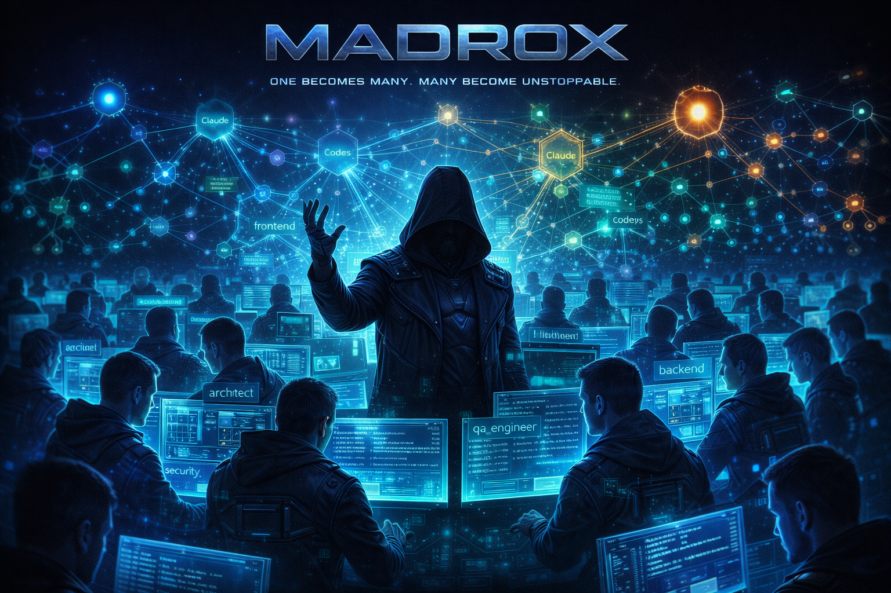
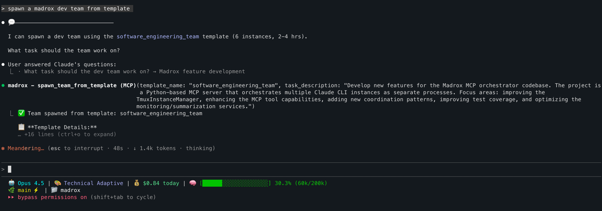

# Madrox - Multi-Agent Orchestrator for Claude & Codex

[](https://www.python.org/downloads/)
[](https://opensource.org/licenses/MIT)
[](https://github.com/barkain/madrox/actions/workflows/test.yml)
[](https://github.com/astral-sh/ruff)

<p align="center">
  
</p>

An MCP server that lets AI instances spawn and manage hierarchical networks of Claude and Codex agents. Build recursive multi-level teams with bidirectional communication, role specialization, task interruption, and real-time monitoring — all orchestrated through tmux sessions.

## Why Madrox?

| Capability | Claude Subagent | Madrox |
|------------|----------------|--------|
| Hierarchy depth | 2 levels (flat) | 3+ levels (recursive) |
| Models | Claude only | Claude + Codex |
| Interruption | Must terminate & restart | Stop & redirect, keep context |
| Visibility | Black box | Full tree view, metrics, dashboard |
| Parallel ops | Sequential only | Batch spawn/message/interrupt |
| Communication | One-way (parent → child) | Bidirectional + peer-to-peer |
| Workspace | Shared | Isolated per-instance |
| Resource tracking | None | Tokens, cost limits, auto-cleanup |

## Quick Start

```bash
# 1. Install
git clone https://github.com/barkain/madrox.git && cd madrox
uv sync && source .venv/bin/activate

# 2. Start (backend + dashboard)
./start.sh

# 3. Register with Claude Code
claude mcp add madrox http://localhost:8001/mcp --transport http
```

**Prerequisites:** Python 3.11+, [tmux](https://github.com/tmux/tmux/wiki/Installing), [uv](https://docs.astral.sh/uv/), npm

Then ask Claude Code to `spawn a madrox dev team from template` — or see [`examples/`](examples/) for scripted usage.

<p align="center">
  
</p>

## Documentation

| Topic | Link |
|-------|------|
| Installation & setup | [docs/SETUP.md](docs/SETUP.md) |
| Architecture & design | [docs/ARCHITECTURE.md](docs/ARCHITECTURE.md) |
| API reference (24+ MCP tools) | [docs/API_REFERENCE.md](docs/API_REFERENCE.md) |
| Features & usage patterns | [docs/FEATURES.md](docs/FEATURES.md) |
| Troubleshooting | [docs/TROUBLESHOOTING.md](docs/TROUBLESHOOTING.md) |
| Team templates | [docs/TEMPLATES.md](docs/TEMPLATES.md) |
| Examples | [examples/](examples/) |

## Contributing

See [CONTRIBUTING.md](CONTRIBUTING.md). Run `uv run pytest tests/ -v` and `uv run ruff check src/` before submitting.

## License

MIT — see [LICENSE](LICENSE).
