# Madrox - Hierarchical Multi-Agent Orchestrator

[](https://www.python.org/downloads/)
[](https://opensource.org/licenses/MIT)
[](https://github.com/barkain/madrox/actions/workflows/test.yml)
[](https://github.com/barkain/madrox/actions/workflows/lint.yml)
[](https://github.com/astral-sh/ruff)

<p align="center">
  
</p>

A Model Context Protocol (MCP) server that enables AI instances to spawn and manage hierarchical networks of Claude and Codex instances. This system supports sophisticated multi-agent orchestration with parent-child relationships, bidirectional communication, role-based specialization, and intelligent coordination across multiple AI models.

## 🌟 See It In Action

Here's how Madrox orchestrates a real-world workflow: **implementing a feature from a research paper**.

```mermaid
graph TD
    User[👤 You: 'Implement transformer attention from this paper']

    User --> Coordinator[🎯 Coordinator Instance<br/>Architect Role]

    Coordinator -->|spawns & delegates| Research[📚 Research Instance<br/>analyze paper]
    Coordinator -->|spawns & delegates| Design[🏗️ Design Instance<br/>system architecture]

    Research -->|paper analysis| Design
    Design -->|architecture spec| Coordinator

    Coordinator -->|parallel spawn| Frontend[⚛️ Frontend Dev<br/>UI components]
    Coordinator -->|parallel spawn| Backend[🔧 Backend Dev<br/>API + logic]
    Coordinator -->|parallel spawn| Codex[🤖 Codex Instance<br/>optimization]

    Frontend -->|progress updates| Coordinator
    Backend -->|progress updates| Coordinator
    Codex -->|optimized code| Backend

    Coordinator -->|spawns when ready| Tester[🧪 Testing Specialist<br/>test suite]
    Coordinator -->|spawns when ready| DocWriter[📝 Documentation Writer<br/>API docs]

    Backend -->|implementation| Tester
    Frontend -->|components| Tester

    Tester -->|test results| Coordinator
    DocWriter -->|documentation| Coordinator

    Coordinator -->|aggregated result| User

    style User fill:#e1f5ff
    style Coordinator fill:#fff3cd
    style Research fill:#d4edda
    style Design fill:#d4edda
    style Frontend fill:#cce5ff
    style Backend fill:#cce5ff
    style Codex fill:#f8d7da
    style Tester fill:#d1ecf1
    style DocWriter fill:#d1ecf1
```



**What's happening:**
1. **Hierarchical Coordination**: Coordinator spawns specialized instances as needed
2. **Parallel Execution**: Frontend, Backend, and Codex work simultaneously
3. **Multi-Model**: Mix Claude instances (architecture, testing) with Codex (optimization)
4. **Dynamic Workflow**: Testing/docs instances spawn only when implementation is ready
5. **Bidirectional Communication**: Children report progress, parent aggregates results

**Result**: Complex multi-week task completed through orchestrated collaboration, not monolithic prompting.

---

## 📸 Real-World Example: Software Development Team

Here's a real instance of Madrox orchestrating a complete software development team with 10 specialized instances working together:

```
team-lead (technical_lead)
├── dev-squad-leader (backend_developer)
│   ├── dev-1 (backend_developer)
│   └── dev-2 (frontend_developer)
├── analysts-squad-leader (data_scientist)
│   ├── analyst-1 (data_scientist)
│   └── analyst-2 (data_scientist)
├── devops-squad-leader (devops)
│   └── devops-1 (devops)
└── architect (architect)
```
### Team Hierarchy


**What you're seeing:**
- **3-Level Hierarchy**: Team Lead → Squad Leaders (+ Architect) → Specialists
- **10 Specialized Instances**: 1 Tech Lead, 3 Squad Leaders, 1 Architect, 5 Specialists
- **Squad Organization**: Dev Squad (2 developers), Analysts Squad (2 data scientists), DevOps Squad (1 engineer)
- **Real-time Status**: Each instance shows current state (idle/busy/running)
- **Parent-Child Relationships**: Clear visualization of reporting structure and delegation paths

### Complete Workflow Execution


**The full development lifecycle:**
1. **Team Lead spawns organization** - Creates 3-level hierarchy with 10 instances total
2. **Squad Leaders coordinate** - Dev, Analysts, and DevOps squad leaders manage their teams
3. **Architect provides guidance** - System design and architectural decisions at leadership level
4. **Parallel Execution** - Squads work concurrently: Dev Squad (backend/frontend), Analysts Squad (data work), DevOps Squad (infrastructure)
5. **Bidirectional Communication** - Specialists report to squad leaders, squad leaders coordinate with Tech Lead
6. **Hierarchical Coordination** - Tech Lead aggregates squad results and manages cross-squad dependencies

This demonstrates Madrox's core strengths: deep hierarchical coordination (3 levels), role specialization with squad organization, parallel execution across multiple squads, and bidirectional communication through the management chain.

---

## 🆚 Why Madrox vs Claude's Built-in Subagent?

Claude has a built-in subagent capability, but Madrox transforms it into a **true multi-agent operating system**. Here's what sets it apart:

### Top 10 Advantages (Ranked by Impact)

| Rank | Feature | Madrox | Claude Subagent | User Value |
|------|---------|--------|-----------------|------------|
| 🥇 | **Hierarchical Depth** | 3+ levels (recursive spawning) | 2 levels max (flat) | 10x complexity handling - instances spawn their own teams |
| 🥈 | **Multi-Model Networks** | Claude + Codex + future models | Claude only | Best-of-breed: use optimal model per task |
| 🥉 | **Task Interruption** | ✅ Stop & redirect without losing context | ❌ Must terminate & restart | Save hours - change direction mid-task |
| 4️⃣ | **Network Visibility** | Full tree view, status, metrics | ❌ Black box | Debug & monitor complex workflows |
| 5️⃣ | **Parallel Operations** | Batch spawn/message/interrupt | ❌ Sequential only | 10x faster - spawn 10 instances simultaneously |
| 6️⃣ | **Bidirectional Comms** | Parent ↔ Child + broadcast | → One-way only | Real coordination - children report back |
| 7️⃣ | **Workspace Isolation** | Per-instance directories | ❌ Shared workspace | Production-safe - no file conflicts |
| 8️⃣ | **Expert Roles** | 10 comprehensive roles (70-120 line prompts) | Generic prompts | Quality multiplier - expert-level outputs |
| 9️⃣ | **Resource Tracking** | Tokens, cost limits, auto-cleanup | ❌ No tracking | Budget protection - prevent runaway costs |
| 🔟 | **State Persistence** | Cross-session, resume workflows | ❌ Per-conversation only | Resume work days later |

### Key Differentiators Explained

**1. True Hierarchical Orchestration** 🏆
- **Madrox**: Crypto Analyst spawns Hash Expert + LCG Expert + Constant Matcher (3 levels deep)
- **Built-in**: Only top-level can spawn, no grandchildren possible
- **Impact**: Handle exponentially complex tasks with natural delegation trees

**2. Multi-Model Networks** 🤖
- **Madrox**: Mix Claude Opus (architecture) + Sonnet (implementation) + Codex (optimization)
- **Built-in**: Claude instances only
- **Impact**: Cost optimization + best model for each task type

**3. Task Interruption & Control** ⚡
- **Madrox**: `interrupt_instance()` - stop work, keep context, redirect
- **Built-in**: No interrupt - must terminate and lose everything
- **Impact**: "Stop profiling, just fix top 3 issues" - saves hours of rework

**4. Network Management** 📊
- **Madrox**: `get_instance_tree()` shows entire network topology in real-time
- **Built-in**: Zero visibility into subagent state
- **Impact**: Debug which instance is stuck, track progress across 20+ instances

**5. Production Features** 💼
- **Madrox**: Workspace isolation, resource limits, health monitoring, cross-session persistence
- **Built-in**: Shared workspace, no limits, ephemeral state
- **Impact**: Safe for real projects, not just demos

### The Bottom Line

**Claude's subagent** is great for simple delegation (1 parent → 3-5 children).

**Madrox** enables **enterprise-grade multi-agent orchestration**:
- 🌳 **Recursive hierarchies** (21+ instances across 3 levels)
- 🎯 **Multi-week workflows** (reverse engineering, feature implementation)
- 💰 **Cost-controlled** (token limits, auto-cleanup)
- 🔄 **Resumable** (persist state across sessions)
- 📊 **Observable** (full network visibility)

**Think of it this way:**
- Built-in subagent = **You + 5 contractors**
- Madrox = **You + Engineering Managers + Team Leads + 15 specialists** (with full org chart visibility)

## 🎯 Features

### Core Orchestration Tools
- **`spawn_claude`** - Spawn new Claude instances with specific roles and configurations
- **`spawn_codex_instance`** - Spawn OpenAI Codex instances for multi-model orchestration
- **`spawn_multiple_instances`** - Spawn multiple instances in parallel for faster setup
- **`send_to_instance`** - Send messages to specific instances and receive responses
- **`send_to_multiple_instances`** - Message multiple instances concurrently
- **`get_instance_output`** - Retrieve output history from instances
- **`get_instance_tree`** - Visualize hierarchical network of all running instances
- **`get_children`** - Query child instances of a parent
- **`broadcast_to_children`** - Broadcast messages to all children of a parent
- **`coordinate_instances`** - Coordinate multiple instances for complex tasks
- **`interrupt_instance`** - Interrupt running task without terminating instance
- **`interrupt_multiple_instances`** - Interrupt multiple instances in parallel
- **`terminate_instance`** - Gracefully terminate instances with proper cleanup

### Advanced Capabilities
- **Multi-Model Support** - Orchestrate both Claude (Anthropic) and Codex (OpenAI) instances
- **Custom MCP Server Configuration** - Dynamic loading of MCP tools (Playwright, databases, APIs) per instance
- **Hierarchical Architecture** - Parent-child relationships with bidirectional communication
- **Instance Tree Visualization** - Real-time network topology with state and type indicators
- **Task Interruption** - Stop running tasks without terminating instances (preserves context)
- **Parallel Spawning** - Launch multiple instances concurrently for performance
- **Non-Blocking Mode** - Background initialization with immediate ID return
- **Message Auto-Injection** - Automatic context sharing from child to parent instances
- **Instance Lifecycle Management** - Complete lifecycle with proper resource cleanup
- **Role-Based Specialization** - 10 predefined roles (architect, frontend dev, backend dev, etc.)
- **Isolated Environments** - Each instance gets its own workspace directory with metadata
- **Message Passing** - Reliable inter-instance communication with timeout handling
- **Parallel Task Execution** - Coordinate multiple instances working in parallel
- **Batch Operations** - Interrupt, message, or query multiple instances simultaneously
- **Browser Automation** - Built-in Playwright MCP support for web scraping and testing
- **Resource Tracking** - Monitor token usage, costs, and performance metrics
- **Health Monitoring** - Automatic health checks with timeout and limit enforcement
- **Consensus Building** - Coordinate instances for decision-making processes
- **Cost Optimization** - Resource limits and usage tracking

## 🚀 Quick Start

### Prerequisites
- Python 3.11+
- [uv](https://docs.astral.sh/uv/) Python package manager - install:
  ```bash
  curl -LsSf https://astral.sh/uv/install.sh | sh
  ```
- [npm](https://docs.npmjs.com/downloading-and-installing-node-js-and-npm) Node Package Manager - install:
  ```bash
  npm install -g npm
  ```


### Installation (4 steps)

**1. Clone and install:**
```bash
git clone https://github.com/barkain/madrox.git
cd madrox
uv sync
```

**2. Start the server:**
```bash
MADROX_TRANSPORT=http python run_orchestrator.py
```

**3. Add MCP to Claude Code:**
```bash
claude mcp add madrox http://localhost:8001/mcp --transport http
```


**4. Open madrox UI:**
```bash
cd frontend
npm install  # install dependencies
npm run dev  # start the UI
```

That's it! Start using Madrox tools in Claude Code to spawn and orchestrate AI instances.
For example, ask Claude Code
```bash
spawn a madrox dev team from template
```


## 🧪 Testing

### Run the comprehensive test suite (86% coverage):
```bash
uv run python -m pytest tests/test_orchestrator.py -v --cov=src/orchestrator
```

### Run the integration demo:
```bash
uv run python tests/integration_demo.py
```

This demo shows a complete workflow building a task management app with 3 specialized instances.

### Run stress tests:
See [docs/FEATURES.md](docs/FEATURES.md) for comprehensive testing and validation patterns including:
- Instance management and lifecycle testing
- Cascade termination testing (2-level and 3-level hierarchies)
- Hierarchy filtering and validation
- Multi-level hierarchy validation (grandparent→parent→child)
- Concurrent operations testing (parallel spawning, messaging)

## 📊 Test Coverage

- **Instance Manager**: 86% coverage
- **Core Models**: 50% coverage
- **Total Tests**: 26 unit tests (25 passing, 1 minor failure)
- **Stress Tests**: 5 comprehensive integration tests validating production scenarios
- **Test Categories**: Unit tests, integration tests, error handling, resource limits, multi-level hierarchies, concurrent operations

## 🔧 Configuration

### Environment Variables
- `ANTHROPIC_API_KEY` - Your Anthropic API key (optional if you use Claude subscription clients)
- `ORCHESTRATOR_HOST` - Server host (default: localhost)
- `ORCHESTRATOR_PORT` - Server port (default: 8001)
- `MAX_INSTANCES` - Maximum concurrent instances (default: 10)
- `WORKSPACE_DIR` - Base workspace directory (default: /tmp/claude_orchestrator)
- `LOG_DIR` - Log storage directory (default: /tmp/madrox_logs)
- `LOG_LEVEL` - Logging level: DEBUG, INFO, WARNING, ERROR (default: INFO)

### Configuration Options
```python
config = OrchestratorConfig(
    server_host="localhost",
    server_port=8001,
    anthropic_api_key="your-key",
    max_concurrent_instances=10,
    max_tokens_per_instance=100000,
    max_total_cost=100.0,
    instance_timeout_minutes=60,
    workspace_base_dir="/tmp/claude_orchestrator",
    log_dir="/tmp/madrox_logs",        # Log storage directory
    log_level="INFO",                   # DEBUG, INFO, WARNING, ERROR
    enable_isolation=True,
)
```

## 🎭 Instance Roles & Customization

### Quick Start: Predefined Roles

For convenience, these ready-made roles are available:

- **General** - Versatile general-purpose assistant
- **Frontend Developer** - React/TypeScript specialist
- **Backend Developer** - Python/API specialist
- **Testing Specialist** - Test automation expert
- **Documentation Writer** - Technical documentation expert
- **Code Reviewer** - Code quality and best practices
- **Architect** - System design and architecture
- **Debugger** - Problem diagnosis and debugging
- **Security Analyst** - Security assessment and hardening
- **Data Analyst** - Data processing and analysis

### Custom Roles

**You're not limited to predefined roles!** Create any specialized instance you need:

```python
# Fully custom role with specialized expertise
instance_id = await manager.spawn_instance(
    name="rust-expert",
    role="general",  # Use any role or general as base
    system_prompt="""You are a Rust systems programming expert with deep knowledge of:
    - Embedded systems and bare-metal programming
    - async/await and tokio runtime internals
    - Zero-cost abstractions and compiler optimizations
    - Safety guarantees and lifetime management"""
)

# Domain-specific expert
instance_id = await manager.spawn_instance(
    name="ml-researcher",
    system_prompt="""You are a machine learning researcher specializing in:
    - Transformer architectures and attention mechanisms
    - PyTorch internals and CUDA optimization
    - Latest papers from arXiv (2024-2025)
    - Distributed training strategies"""
)
```

**Key Point:** When you provide a `system_prompt`, it completely overrides the predefined role behavior, giving you full control over the instance's expertise and personality.

### Customizing Role Prompts

All predefined role prompts are stored as text files in `resources/prompts/` and can be easily customized:

```bash
# View available prompts
ls resources/prompts/

# Edit a role's system prompt
vim resources/prompts/backend_developer.txt

# Changes take effect immediately for new instances
```

Each prompt file contains comprehensive expertise, best practices, and behavioral guidelines researched from 2025 industry standards. See `resources/prompts/README.md` for details on prompt structure and customization options.

## 🔗 MCP Protocol Integration

### Claude Desktop / Claude for macOS & Windows
1. Open the Claude desktop configuration file:
   - macOS: `~/Library/Application Support/Claude/claude_desktop_config.json`
   - Windows: `%APPDATA%\Claude\claude_desktop_config.json`
2. Add a new entry under `mcpServers`:
   ```json
   {
     "mcpServers": {
      "madrox": {
        "command": "uv",
        "args": ["run", "python", "run_orchestrator.py"],
        "cwd": "path/to/madrox",
        "env": {
          "ANTHROPIC_API_KEY": "your-api-key"
        }
      }
     }
   }
  ```
  Omit the `env` block entirely if you don't need a direct Anthropic API key.
  Replace the `command` value with the absolute path to `uv` on your machine
  (run `command -v uv` in a shell to find it). Claude Desktop launches MCP
  servers with a minimal `PATH`, so the explicit path prevents “No such file or
  directory (os error 2)” when starting Madrox.
   If the FastAPI app is already running, you can instead use the HTTP transport:
   ```json
   {
     "mcpServers": {
       "madrox": {
         "url": "http://localhost:8001",
         "transport": "http"
       }
     }
   }
   ```
3. Save the file and restart Claude so it loads the new server.

### Claude Code (VS Code Extension)
1. In VS Code run the command palette action `Claude: Edit Connection Settings`.
2. Add the same `mcpServers.madrox` block (either `command/args` or `url/transport`).
3. Save the file; use `Claude: Reload Connections` if the tools do not appear immediately.

### Claude Code CLI
Use the CLI helper to register the server:
```bash
# Register the MCP server (uses your Claude Code authentication)
claude mcp add madrox http://localhost:8001/mcp --transport http

# Optional: add API key if needed for spawned instances
claude mcp add madrox http://localhost:8001/mcp --transport http \
  -e ANTHROPIC_API_KEY=your-api-key

# Verify registration
claude mcp list
```

**Note:** Model selection happens when spawning instances via MCP tools, not during registration.

For direct chats without MCP, you can launch the Claude CLI with a specific model:

```bash
claude --model claude-sonnet-4-20250514
claude --model claude-opus-4-1-20250805
claude --model claude-3-5-haiku-20241022
```

Restart any active `claude` session so the new MCP tools are available.

### HTTP Endpoints
The server also exposes friendly REST endpoints that mirror the MCP tools:
- `/tools` - List available orchestration tools
- `/tools/execute` - Execute orchestration commands
- `/health` - Health check endpoint
- `/instances` - List all instances
- `/instances/{id}` - Get specific instance details

## 📋 Usage Examples

### Example 1: Basic Instance Spawning
```python
# Spawn a frontend developer
instance_id = await manager.spawn_instance(
    name="React Developer",
    role="frontend_developer",
    system_prompt="You are a React expert specializing in TypeScript and modern UI patterns."
)

# Send a development task
response = await manager.send_to_instance(
    instance_id,
    "Create a responsive navigation component with dropdown menus"
)
```

### Example 2: Hierarchical Multi-Instance Network
```python
# Spawn a coordinator parent
coordinator_id = await manager.spawn_instance(
    name="Project Manager",
    role="general"
)

# Parent spawns its own children
await manager.send_to_instance(
    coordinator_id,
    "Spawn two child instances: a frontend developer and a backend developer. "
    "Pass your instance_id as parent_instance_id for both."
)

# Query children from parent
children = manager.get_children(coordinator_id)
# Returns: [{"id": "...", "name": "frontend-dev", ...}, {"id": "...", "name": "backend-dev", ...}]

# Broadcast message to all children
await manager.broadcast_to_children(
    parent_id=coordinator_id,
    message="Start working on the user authentication feature",
    wait_for_responses=True
)

# Visualize the network
tree = manager.get_instance_tree()
print(tree)
# Output:
# Project Manager (abc123...) [idle] (claude)
# ├── frontend-dev (def456...) [running] (claude)
# └── backend-dev (ghi789...) [running] (claude)
```

### Example 3: Multi-Model Orchestration (Claude + Codex)
```python
# Spawn both Claude and Codex instances in parallel
instances = await manager.spawn_multiple_instances([
    {"name": "claude-architect", "role": "architect"},
    {"name": "codex-coder", "instance_type": "codex"}
])

# Send tasks to both models
await manager.send_to_multiple_instances([
    {
        "instance_id": instances[0],
        "message": "Design a microservices architecture for an e-commerce platform"
    },
    {
        "instance_id": instances[1],
        "message": "Generate boilerplate code for user service with authentication"
    }
])

# Check the full network topology
tree = manager.get_instance_tree()
```

### Example 4: Custom MCP Server Configuration (Browser Automation)
```python
from orchestrator.mcp_loader import get_mcp_servers

# Load prebuilt MCP configs
mcp_servers = get_mcp_servers("playwright", "memory")

# Spawn Claude instance with Playwright for browser automation
browser_agent = await manager.spawn_instance(
    name="web-scraper",
    role="data_analyst",
    mcp_servers=mcp_servers
)

# Agent now has access to Playwright tools
await manager.send_to_instance(
    browser_agent,
    "Navigate to https://example.com and extract all article titles"
)

# Spawn Codex instance with Playwright
codex_browser = await manager.spawn_codex_instance(
    name="codex-automation",
    sandbox_mode="workspace-write",
    mcp_servers={"playwright": {"command": "npx", "args": ["@playwright/mcp@latest"]}}
)

# Mix multiple MCP servers
mcp_servers = get_mcp_servers(
    "playwright",    # Browser automation
    "github",        # GitHub operations
    "postgres",      # Database access
)
```

### Example 5: Parallel Spawning & Non-Blocking Mode
```python
# Spawn multiple instances in parallel for faster setup
instance_ids = await manager.spawn_multiple_instances([
    {"name": "worker-1", "role": "general", "wait_for_ready": False},
    {"name": "worker-2", "role": "general", "wait_for_ready": False},
    {"name": "worker-3", "role": "general", "wait_for_ready": False},
])
# Returns immediately with IDs, instances initialize in background

# Message all workers simultaneously
await manager.send_to_multiple_instances([
    {"instance_id": id, "message": "Process dataset chunk", "wait_for_response": False}
    for id in instance_ids
])
```

### Example 6: Task Interruption & Control
```python
# Start a long-running task
instance_id = await manager.spawn_instance(
    name="Data Processor",
    role="general"
)

await manager.send_to_instance(
    instance_id,
    "Process this large dataset and generate comprehensive statistics",
    wait_for_response=False
)

# Wait a bit, then interrupt the task without terminating the instance
await asyncio.sleep(10)
result = await manager.interrupt_instance(instance_id)
# Instance shows: "⎿ Interrupted · What should Claude do instead?"

# Send a new task - context is preserved
await manager.send_to_instance(
    instance_id,
    "Instead, just summarize the first 100 rows"
)

# Interrupt multiple instances in parallel
await manager.interrupt_multiple_instances([instance_id_1, instance_id_2, instance_id_3])
```

### Example 7: Resource Management
```python
# Spawn with resource limits
instance_id = await manager.spawn_instance(
    name="Limited Instance",
    role="general",
    max_total_tokens=50000,
    max_cost=10.0,
    timeout_minutes=30
)

# Monitor resource usage
status = manager.get_instance_status(instance_id)
print(f"Tokens used: {status['total_tokens_used']}")
print(f"Cost: ${status['total_cost']:.4f}")
```

## 📑 Task Templates

Madrox provides production-ready templates for common multi-agent workflows. Deploy complete teams in minutes instead of designing network structures from scratch.

### Available Templates

| Template | Team Size | Duration | Best For |
|----------|-----------|----------|----------|
| **[Software Engineering Team](templates/software_engineering_team.md)** | 6 instances | 2-4 hours | SaaS apps, APIs, full-stack products |
| **[Research Analysis Team](templates/research_analysis_team.md)** | 5 instances | 2-3 hours | Market research, competitive intelligence |
| **[Security Audit Team](templates/security_audit_team.md)** | 7 instances | 2-4 hours | Security reviews, compliance assessments |
| **[Data Pipeline Team](templates/data_pipeline_team.md)** | 5 instances | 2-4 hours | ETL pipelines, data lake ingestion |

### Quick Start with Templates

**1. Choose a template** that matches your task (e.g., building a SaaS app → Software Engineering Team)

**2. Spawn supervisor:**
```
Use spawn_claude:
- name: "tech-lead"
- role: "architect"
```

**3. Send template instructions** with your task description:
```
Execute the Software Engineering Team workflow:

TASK: Build a task management SaaS with user auth, CRUD operations,
PostgreSQL database, React frontend, and Docker deployment.

Follow template phases: Team Assembly → Briefing → Design → Implementation →
Integration → Documentation. Ensure bidirectional communication with reply_to_caller.
```

**4. Monitor progress** using `get_live_instance_status`, `get_pending_replies`, and `get_instance_tree`

### Template Features

- **Production-Ready**: Include error handling, monitoring, resource constraints
- **Best Practices**: Proven coordination patterns and communication protocols
- **Customizable**: Easily adapt team size, roles, and workflow phases
- **Instruction-Based**: No code blocks - clear workflow guidance

See **[docs/TEMPLATES.md](docs/TEMPLATES.md)** for complete template usage guide, customization options, and advanced patterns.

## 🛡️ Security & Isolation

- **Workspace Isolation** - Each instance gets its own directory
- **Resource Limits** - Token, cost, and time limits per instance
- **Health Monitoring** - Automatic cleanup of stuck or excessive instances
- **Graceful Shutdown** - Proper cleanup on termination
- **Error Recovery** - Timeout handling and retry mechanisms

## 🔍 Monitoring & Debugging

### Health Checks
The system performs automatic health checks every minute:
- Instance timeout detection
- Resource limit enforcement
- Error tracking and recovery
- Automatic cleanup of terminated instances
- Process liveness monitoring with psutil

### Comprehensive Logging & Audit System

Madrox provides enterprise-grade logging for full instance auditability and debugging:

#### Per-Instance Logs

Each instance maintains isolated log files in `/tmp/madrox_logs/instances/{instance_id}/`:

| Log File | Format | Purpose | Retention |
|----------|--------|---------|-----------|
| **instance.log** | Text | Lifecycle events (spawn, init, terminate) | 5MB rotating, 3 backups |
| **communication.jsonl** | JSON Lines | Message I/O with timing and costs | Full history |
| **tmux_output.log** | Text | Raw tmux captures for debugging | Append-only |
| **metadata.json** | JSON | Instance configuration and details | Single file |

#### Audit Trail

System-wide audit logs in `/tmp/madrox_logs/audit/`:

```jsonl
{"timestamp": "2025-10-03T12:30:45", "event": "instance_spawn", "instance_id": "abc123", ...}
{"timestamp": "2025-10-03T12:31:10", "event": "message_exchange", "instance_id": "abc123", ...}
{"timestamp": "2025-10-03T12:35:20", "event": "instance_terminate", "instance_id": "abc123", ...}
```

**Features:**
- JSON Lines format for structured queries
- Daily rotation with 30-day retention
- Captures: spawn, terminate, message_exchange events
- Tracks: tokens, cost, response times, uptime

#### Query Examples

```python
# Get instance logs
logs = await manager.get_instance_logs(
    instance_id="abc123",
    log_type="communication",  # or "instance", "tmux_output"
    tail=100  # last 100 lines, 0 for all
)

# Query audit trail
audit = await manager.get_audit_logs(
    since="2025-10-03T00:00:00",  # optional timestamp filter
    limit=100
)

# List all instances with logs
instances = await manager.list_logged_instances()
# Returns: [{"instance_id": "...", "instance_name": "...", "created_at": "..."}, ...]
```

#### Log Configuration

```python
config = OrchestratorConfig(
    log_dir="/tmp/madrox_logs",  # Log storage location
    log_level="INFO",             # DEBUG, INFO, WARNING, ERROR
    # ... other config
)
```

#### Communication Log Example

```jsonl
{"timestamp": "2025-10-03T12:31:10.123", "event_type": "message_sent", "message_id": "msg-001", "direction": "outbound", "content": "What is 2+2?", "tokens": 5}
{"timestamp": "2025-10-03T12:31:12.456", "event_type": "message_received", "message_id": "msg-001", "direction": "inbound", "content": "4", "tokens": 8, "cost": 0.00008, "response_time": 2.333}
```

#### Benefits

- ✅ **Full Audit Trail** - Complete history of all instance operations
- ✅ **Debugging Support** - Raw tmux outputs for stuck instance analysis
- ✅ **Performance Metrics** - Response times, token usage per message
- ✅ **Cost Tracking** - Per-instance and aggregate cost monitoring
- ✅ **Compliance** - Structured logs for audit requirements
- ✅ **Programmatic Access** - JSON format for automated analysis

### Metrics
- Total instances created/active/terminated
- Token usage and cost tracking per instance
- Response times and success rates
- Health scores and error counts
- Full message exchange history with timestamps

## 🚨 Error Handling

- **Timeout Management** - Configurable timeouts for all operations
- **Resource Exhaustion** - Automatic termination when limits exceeded
- **Communication Errors** - Retry logic and fallback handling
- **Instance Failures** - Graceful degradation and cleanup
- **Validation** - Input validation and sanitization

## 🔧 Troubleshooting

### Common Issues

1. **Server won't start**: Check FastAPI/uvicorn installation
2. **Instance spawn fails**: Verify Anthropic API key
3. **Tests fail**: Ensure pytest and dependencies installed
4. **Type errors**: Check Python version (3.11+ required)

### Debug Mode
```bash
export LOG_LEVEL=DEBUG
python run_orchestrator.py
```

## 📈 Performance

- **Concurrent Instances**: Up to 10 instances by default (configurable)
- **Response Times**: Sub-second for management operations
- **Memory Usage**: Efficient with workspace isolation
- **Scalability**: Designed for production workloads

## 🗺️ Roadmap

### Network Visibility & Monitoring
- **Instance Network Dashboard** - Real-time visualization of the entire Madrox network topology
- **Cross-Instance Metrics** - Monitor resource usage, message flow, and performance across all instances
- **Network Health Monitoring** - Automatic detection of bottlenecks and communication issues
- **Inter-Instance Communication Logs** - Trace message paths through the hierarchy

### Deployment & Distribution
- **Docker Container Support** - Serve Madrox as a containerized MCP server
- **Installable MCP Package** - NPM/PyPI package for easy installation without git clone

### Workflow & Orchestration
- **Complex Workflow Engine** - Define and deploy multi-step workflows across instance networks
- **Workflow Templates** - Pre-built patterns:
  - Reverse Engineering (analyze → document → reproduce)
  - Feature from Paper (research → design → implement → validate)
  - Codebase Migration (audit → plan → convert → test)
  - Security Audit (scan → analyze → report → remediate)
  - Performance Optimization (profile → identify bottlenecks → optimize → benchmark)
  - API Integration (explore docs → design client → implement → test)
  - Bug Investigation (reproduce → diagnose → fix → verify)
  - Code Refactoring (analyze → plan → refactor → validate)
  - Documentation Generation (analyze code → structure docs → write → review)
  - Test Suite Creation (analyze coverage → design tests → implement → validate)
- **Conditional Execution** - Branch workflows based on instance outputs
- **State Persistence** - Save and resume long-running workflows across sessions
- **Workflow Visualization** - Interactive diagram of workflow execution progress

### Multi-Model Integration
- **OpenAI GPT-4/5 Support** - Direct integration with OpenAI models (beyond Codex)
- **Gemini Integration** - Add Google Gemini instances to networks
- **Local LLM Support** - Integrate Ollama, LM Studio, and other local models
- **Model Selection Strategies** - Auto-select optimal model for each task type

### Advanced Features
- **Cost Optimization Engine** - Intelligent routing to minimize API costs
- **Auto-Scaling** - Dynamic instance spawning based on workload
- **Checkpoint & Recovery** - Automatic state snapshots with rollback capability
- **Security Hardening** - Role-based access control, audit logs, secrets management
- **Plugin System** - Custom tools and capabilities for instances

### Developer Experience
- **Web UI Console** - Browser-based management interface for networks
- **CLI Tool** - Command-line interface for quick operations
- **VS Code Extension** - Manage instances directly from IDE
- **Debugging Tools** - Step-through execution, breakpoints for workflows
- **Performance Profiling** - Identify slow operations and optimize network topology

Contributions and feedback on roadmap priorities are welcome!

## 📚 Documentation

Comprehensive documentation is available in the `docs/` directory:

### Getting Started
- **[SETUP.md](docs/SETUP.md)** - Complete installation and setup guide
  - System prerequisites and requirements
  - Installation methods (Quick Start, Docker, Manual)
  - MCP client configuration (Claude Desktop, Claude Code, Codex CLI)
  - Configuration and verification

### Technical Reference
- **[ARCHITECTURE.md](docs/ARCHITECTURE.md)** - System architecture and design
  - High-level architecture diagrams
  - Core components and their responsibilities
  - Communication patterns and protocols
  - Inter-Process Communication (IPC) with SharedStateManager
  - Security model and isolation
  - Containerization and deployment

- **[API_REFERENCE.md](docs/API_REFERENCE.md)** - Complete API documentation
  - MCP tools reference (24+ tools)
  - HTTP REST API endpoints
  - Configuration options and environment variables
  - Return types and error responses

- **[IPC_IMPLEMENTATION_GUIDE.md](docs/IPC_IMPLEMENTATION_GUIDE.md)** - IPC implementation details
  - Cross-process shared state architecture
  - SharedStateManager API and usage
  - Integration with STDIO transport
  - Testing and verification guide
  - Known issues and future improvements

### Usage & Features
- **[FEATURES.md](docs/FEATURES.md)** - Feature documentation and usage patterns
  - Instance management (spawning, termination, lifecycle)
  - Communication patterns (messaging, coordination, broadcasting)
  - Hierarchical orchestration examples
  - Testing and validation patterns

### Operations
- **[TROUBLESHOOTING.md](docs/TROUBLESHOOTING.md)** - Debugging and problem resolution
  - Quick diagnostics and health checks
  - Common issues and solutions
  - Performance optimization
  - Log analysis and debugging tools

## 🤝 Contributing

Contributions are welcome! Please follow these guidelines:

1. Follow existing code patterns and style
2. Maintain test coverage above 85%
3. Use modern Python syntax (3.11+)
4. Add comprehensive error handling
5. Update documentation for new features

## 📜 License

MIT License - See LICENSE file for details.

---

**Ready for production use with comprehensive testing, monitoring, and documentation!**
