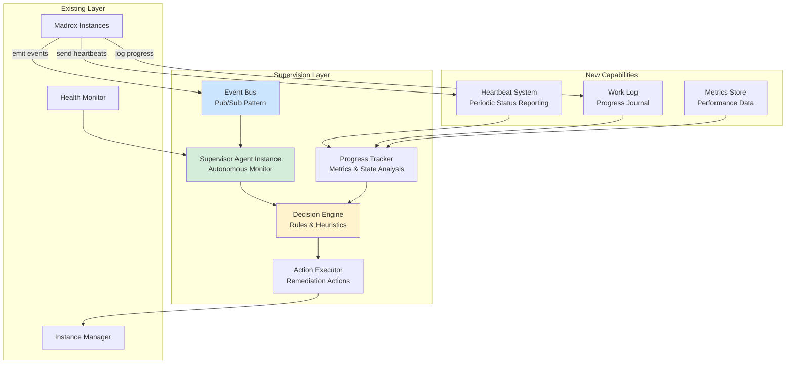

# Autonomous Supervision System Design

## Executive Summary

This document proposes an autonomous supervision system for Madrox networks that enables self-monitoring, issue detection, and self-healing without user intervention. The system introduces a **Supervisor Agent** pattern with event-driven monitoring, progress tracking, and autonomous decision-making.

---

## Problem Statement

### Current Limitations

1. **Gate-keeper Bottleneck**: Main Claude agent acts as sole communication gate
2. **No Autonomy After Response**: When main agent finishes, network supervision stops
3. **Limited Health Detection**: Only basic timeout/resource limit checks
4. **No Progress Tracking**: Can't detect if instances are actually making progress
5. **No Issue Detection**: Can't identify stuck, waiting, idle, or troubled instances
6. **User as Monitor**: User must manually check network status

### Required Capabilities

Autonomous system must detect and handle:
- **Stuck instances**: Not progressing on task despite being "busy"
- **Waiting instances**: Completed work, awaiting next instruction
- **Idle instances**: Haven't received instructions or work
- **Troubled instances**: Encountering errors, asking for help
- **Deadlocks**: Circular dependencies between instances
- **Resource inefficiencies**: Underutilized or overloaded instances

---

## Architecture Overview

### Core Components



---

## Component Design

### 1. Supervisor Agent

**Type**: Special Madrox instance with elevated privileges

**System Prompt** (excerpt):
```
You are the Supervisor Agent for a Madrox network. Your role is to:

1. Monitor all instances in the network for health and progress
2. Detect issues: stuck, waiting, idle, troubled instances
3. Make autonomous decisions to resolve issues
4. Coordinate work distribution and load balancing
5. Report critical issues that require escalation

You have access to:
- Network topology and instance states
- Progress metrics and work logs
- Event stream of all network activity
- Tools to send messages, spawn instances, terminate instances

Decision Guidelines:
- Intervene when instances are stuck >5 minutes with no progress
- Reassign work when instances are waiting >2 minutes
- Balance load when instances show >80% busy time
- Escalate when >3 consecutive interventions fail
- Maintain network efficiency target: >70% productive time
```

**Responsibilities**:
- Monitor event bus for network activity
- Analyze progress metrics for anomalies
- Execute remediation actions autonomously
- Escalate unresolvable issues (to user or higher supervisor)
- Maintain network health dashboard

**Lifecycle**:
```
1. Spawn automatically when network is created
2. Run continuously in background
3. Periodic evaluation cycle (every 30-60 seconds)
4. Terminate only when entire network terminates
```

### 2. Event Bus

**Pattern**: Publish-Subscribe with typed events

**Event Types**:

```python
class NetworkEvent:
    """Base class for all network events."""
    timestamp: datetime
    event_type: str
    instance_id: str
    metadata: dict[str, Any]

class InstanceStateChangedEvent(NetworkEvent):
    """Instance transitioned between states."""
    old_state: str  # idle, busy, waiting, error
    new_state: str
    reason: str

class MessageExchangeEvent(NetworkEvent):
    """Message sent/received between instances."""
    from_instance_id: str
    to_instance_id: str
    message_id: str
    direction: str  # sent, received
    correlation_id: str | None

class ProgressUpdateEvent(NetworkEvent):
    """Instance reported progress on task."""
    task_id: str
    progress_type: str  # started, checkpoint, completed, failed
    progress_data: dict

class HealthCheckEvent(NetworkEvent):
    """Health check result for instance."""
    health_status: str  # healthy, degraded, unhealthy
    checks: dict[str, bool]

class ErrorEvent(NetworkEvent):
    """Instance encountered an error."""
    error_type: str
    error_message: str
    severity: str  # warning, error, critical

class IdleEvent(NetworkEvent):
    """Instance has been idle for threshold period."""
    idle_duration_seconds: int
    last_activity: datetime
```

**Implementation**:
```python
class EventBus:
    """In-memory event bus using asyncio queues."""

    def __init__(self):
        self.subscribers: dict[str, list[asyncio.Queue]] = {}
        self.event_history: deque[NetworkEvent] = deque(maxlen=1000)

    async def publish(self, event: NetworkEvent):
        """Publish event to all subscribers."""
        self.event_history.append(event)

        # Notify all subscribers for this event type
        for queue in self.subscribers.get(event.event_type, []):
            await queue.put(event)

        # Notify wildcard subscribers
        for queue in self.subscribers.get("*", []):
            await queue.put(event)

    def subscribe(self, event_type: str) -> asyncio.Queue:
        """Subscribe to events of a specific type."""
        queue = asyncio.Queue()
        if event_type not in self.subscribers:
            self.subscribers[event_type] = []
        self.subscribers[event_type].append(queue)
        return queue
```

**Integration Points**:
- **TmuxInstanceManager**: Emit events on state changes, message send/receive
- **Health Monitor**: Emit HealthCheckEvent on each check
- **Instances**: Emit ProgressUpdateEvent via new MCP tool

### 3. Progress Tracker

**Purpose**: Track actual work progress beyond state machine

**Metrics Tracked**:

| Metric | Type | Purpose |
|--------|------|---------|
| **Last Activity** | Timestamp | Detect truly idle instances |
| **Messages Sent/Received** | Counter | Measure communication activity |
| **Work Checkpoints** | Timeline | Track task progress milestones |
| **Tool Executions** | Counter + Types | Measure actual work being done |
| **Output Volume** | Bytes/Lines | Detect stalled output generation |
| **Error Rate** | Percentage | Identify troubled instances |
| **Busy Time Ratio** | Percentage | Measure utilization |
| **Response Latency** | Duration | Detect performance degradation |

**Progress States** (more granular than instance states):

```python
class ProgressState(Enum):
    ACTIVE = "active"              # Making progress, recent activity
    WAITING = "waiting"            # Idle, awaiting input/response
    STUCK = "stuck"                # Busy but no progress indicators
    DEGRADED = "degraded"          # Progressing but slower than baseline
    ERROR_LOOP = "error_loop"      # Repeated errors without resolution
    IDLE = "idle"                  # No activity, no assigned work
    HEALTHY = "healthy"            # Normal operation
```

**Detection Heuristics**:

```python
def analyze_progress_state(instance_metrics: InstanceMetrics) -> ProgressState:
    """Determine progress state from metrics."""

    # Stuck: busy but no checkpoints >5 min
    if (instance.state == "busy" and
        time_since_last_checkpoint() > 300 and
        tool_executions_last_5min == 0):
        return ProgressState.STUCK

    # Waiting: idle with recent completion
    if (instance.state == "idle" and
        last_checkpoint.type == "completed" and
        time_since_last_message() > 120):
        return ProgressState.WAITING

    # Error loop: >3 errors in 5 minutes
    if errors_in_window(300) > 3:
        return ProgressState.ERROR_LOOP

    # Degraded: progress rate < 50% of baseline
    if progress_rate() < baseline_rate() * 0.5:
        return ProgressState.DEGRADED

    # Active: recent activity with progress
    if (time_since_last_activity() < 60 and
        time_since_last_checkpoint() < 300):
        return ProgressState.ACTIVE

    return ProgressState.HEALTHY
```

**Storage**:
```python
class ProgressMetrics:
    """Per-instance progress metrics."""
    instance_id: str
    last_activity: datetime
    last_checkpoint: datetime
    checkpoints: list[Checkpoint]  # Last 50
    tool_executions: Counter[str]  # Tool type -> count
    messages_sent: int
    messages_received: int
    error_count: int
    busy_time_seconds: int
    idle_time_seconds: int
    output_lines: int
    baseline_progress_rate: float  # Checkpoints per hour
```

### 4. Decision Engine

**Purpose**: Autonomous decision-making based on network state

**Decision Framework**:

```python
class Decision:
    """Represents a supervision decision."""
    decision_id: str
    trigger_event: NetworkEvent
    affected_instances: list[str]
    decision_type: DecisionType
    rationale: str
    actions: list[Action]
    priority: int  # 1 (high) to 5 (low)
    confidence: float  # 0.0 to 1.0

class DecisionType(Enum):
    INTERVENE = "intervene"        # Send message to instance
    REASSIGN = "reassign"          # Move work to another instance
    SPAWN_HELPER = "spawn_helper"  # Create new instance to assist
    TERMINATE = "terminate"        # Kill stuck/failed instance
    ESCALATE = "escalate"          # Alert user/higher supervisor
    REBALANCE = "rebalance"        # Redistribute work
    RESTART = "restart"            # Terminate and respawn
    COORDINATE = "coordinate"      # Broker communication between instances
```

**Rule Types**:

**1. Stuck Instance Rule**:
```python
if (progress_state == ProgressState.STUCK and
    intervention_count < 3):
    return Decision(
        decision_type=DecisionType.INTERVENE,
        actions=[
            SendMessageAction(
                instance_id=stuck_instance,
                message="You haven't made progress in 5 minutes. "
                       "Can you provide a status update? "
                       "Are you blocked on something?"
            )
        ],
        confidence=0.9
    )
```

**2. Waiting Instance Rule**:
```python
if (progress_state == ProgressState.WAITING and
    has_pending_work_in_queue()):
    return Decision(
        decision_type=DecisionType.REASSIGN,
        actions=[
            SendMessageAction(
                instance_id=waiting_instance,
                message="Next task: " + get_next_work_item()
            )
        ],
        confidence=0.95
    )
```

**3. Error Loop Rule**:
```python
if progress_state == ProgressState.ERROR_LOOP:
    if can_spawn_helper():
        return Decision(
            decision_type=DecisionType.SPAWN_HELPER,
            actions=[
                SpawnInstanceAction(
                    role="debugger",
                    system_prompt="Assist with debugging errors",
                    parent_id=coordinator_id
                ),
                SendMessageAction(
                    instance_id=troubled_instance,
                    message="A debugging specialist has been spawned to assist you."
                )
            ],
            confidence=0.8
        )
    else:
        return Decision(
            decision_type=DecisionType.ESCALATE,
            actions=[
                EscalateAction(
                    message=f"Instance {instance_id} in error loop, "
                           f"cannot spawn helper (limit reached)"
                )
            ],
            confidence=0.9
        )
```

**4. Deadlock Detection**:
```python
def detect_deadlock(network: NetworkTopology) -> Decision | None:
    """Detect circular wait conditions."""

    # Build wait-for graph
    wait_graph = build_wait_graph(network)

    # Find cycles using DFS
    cycles = find_cycles(wait_graph)

    if cycles:
        return Decision(
            decision_type=DecisionType.COORDINATE,
            actions=[
                SendMessageAction(
                    instance_id=cycle[0],
                    message="Deadlock detected. Breaking cycle by providing "
                           "interim response to unblock other instances."
                )
            ],
            confidence=0.85
        )
```

### 5. Action Executor

**Purpose**: Execute decisions made by decision engine

**Action Types**:

```python
class Action:
    """Base class for supervisor actions."""
    action_id: str
    action_type: str
    target_instance_id: str | None
    parameters: dict[str, Any]

class SendMessageAction(Action):
    """Send message to instance."""
    message: str
    wait_for_response: bool = True
    timeout_seconds: int = 30

class SpawnInstanceAction(Action):
    """Spawn new instance."""
    name: str
    role: str
    system_prompt: str
    parent_id: str

class TerminateInstanceAction(Action):
    """Terminate instance."""
    force: bool = False
    reason: str

class ReassignWorkAction(Action):
    """Reassign work from one instance to another."""
    from_instance_id: str
    to_instance_id: str
    work_item: dict

class EscalateAction(Action):
    """Escalate issue to user."""
    severity: str  # warning, error, critical
    message: str
    affected_instances: list[str]
```

**Execution**:
```python
class ActionExecutor:
    """Executes supervisor actions."""

    async def execute(self, action: Action) -> ActionResult:
        """Execute an action and return result."""

        if isinstance(action, SendMessageAction):
            response = await self.manager.send_to_instance(
                instance_id=action.target_instance_id,
                message=action.message,
                wait_for_response=action.wait_for_response
            )
            return ActionResult(success=True, data=response)

        elif isinstance(action, SpawnInstanceAction):
            instance_id = await self.manager.spawn_instance(
                name=action.name,
                role=action.role,
                system_prompt=action.system_prompt,
                parent_instance_id=action.parent_id
            )
            return ActionResult(success=True, instance_id=instance_id)

        elif isinstance(action, TerminateInstanceAction):
            success = await self.manager.terminate_instance(
                instance_id=action.target_instance_id,
                force=action.force
            )
            return ActionResult(success=success)

        elif isinstance(action, EscalateAction):
            # Store escalation in database/logs
            await self.escalation_handler.escalate(
                severity=action.severity,
                message=action.message,
                instances=action.affected_instances
            )
            return ActionResult(success=True)
```

### 6. Transcript Analysis System (Primary Monitoring)

**Purpose**: Analyze instance terminal output and conversation transcripts to detect progress and issues

**Philosophy**: Leverage existing rich data sources (tmux output, message history) rather than requiring explicit instrumentation.

**Data Sources**:
1. **Tmux pane content**: Full terminal transcript via `get_tmux_pane_content()`
2. **Message history**: Complete conversation logs
3. **Communication logs**: All message exchanges (already logged)

**Implementation**:
```python
class TranscriptAnalyzer:
    """Analyzes instance transcripts for progress signals."""

    def __init__(self, instance_manager: InstanceManager):
        self.manager = instance_manager
        self.last_analysis: dict[str, datetime] = {}
        self.baseline_patterns: dict[str, PatternProfile] = {}

    async def analyze_instance_transcript(
        self,
        instance_id: str,
        lines: int = 100
    ) -> TranscriptAnalysis:
        """Analyze recent transcript for progress signals."""

        # Get tmux pane content (last 100 lines)
        transcript = await self.manager.get_tmux_pane_content(
            instance_id,
            lines=lines
        )

        # Extract progress signals from natural language
        signals = self._extract_progress_signals(transcript)

        # Detect issues from output patterns
        issues = self._detect_issues(transcript, signals)

        # Compare to baseline to detect anomalies
        anomalies = self._detect_anomalies(instance_id, transcript)

        return TranscriptAnalysis(
            instance_id=instance_id,
            timestamp=datetime.now(UTC),
            signals=signals,
            issues=issues,
            anomalies=anomalies,
            output_volume=len(transcript),
            last_output_time=self._extract_last_activity(transcript)
        )

    def _extract_progress_signals(self, transcript: str) -> list[ProgressSignal]:
        """Extract progress signals from natural language."""
        signals = []

        # Pattern: Task completion
        if re.search(r'\b(completed|finished|done)\b.*\b(task|analysis|processing)', transcript, re.I):
            signals.append(ProgressSignal(type="completion", confidence=0.9))

        # Pattern: Active work
        if re.search(r'\b(working on|analyzing|processing|implementing)\b', transcript, re.I):
            signals.append(ProgressSignal(type="active", confidence=0.85))

        # Pattern: Blocked/stuck
        if re.search(r'\b(blocked|waiting for|stuck|cannot proceed)\b', transcript, re.I):
            signals.append(ProgressSignal(type="blocked", confidence=0.9))

        # Pattern: Requesting help
        if re.search(r'\b(need help|assistance needed|not sure how)\b', transcript, re.I):
            signals.append(ProgressSignal(type="requesting_help", confidence=0.85))

        # Pattern: Error/failure
        if re.search(r'\b(error|failed|exception|traceback)\b', transcript, re.I):
            signals.append(ProgressSignal(type="error", confidence=0.95))

        # Pattern: Tool usage (indicates activity)
        tool_pattern = r'<invoke name="(\w+)">'
        tools_used = re.findall(tool_pattern, transcript)
        if tools_used:
            signals.append(ProgressSignal(
                type="tool_execution",
                confidence=0.95,
                details={"tools": tools_used}
            ))

        return signals

    def _detect_issues(
        self,
        transcript: str,
        signals: list[ProgressSignal]
    ) -> list[Issue]:
        """Detect issues from transcript patterns."""
        issues = []

        # No output in transcript = potentially stuck
        if len(transcript.strip()) < 50:
            issues.append(Issue(
                type="no_output",
                severity="warning",
                description="Very little output in recent transcript"
            ))

        # Repeated errors
        error_count = transcript.lower().count("error")
        if error_count > 3:
            issues.append(Issue(
                type="error_loop",
                severity="error",
                description=f"Multiple errors detected ({error_count})"
            ))

        # Blocked signal without resolution
        blocked_signals = [s for s in signals if s.type == "blocked"]
        if blocked_signals:
            issues.append(Issue(
                type="blocked",
                severity="warning",
                description="Instance reports being blocked"
            ))

        return issues

    def _detect_anomalies(
        self,
        instance_id: str,
        transcript: str
    ) -> list[Anomaly]:
        """Detect anomalies compared to baseline behavior."""
        anomalies = []

        # Get baseline pattern for this instance
        baseline = self.baseline_patterns.get(instance_id)
        if not baseline:
            # First analysis - establish baseline
            self.baseline_patterns[instance_id] = self._create_pattern_profile(transcript)
            return []

        # Check output volume anomaly
        current_volume = len(transcript)
        if current_volume < baseline.avg_output_volume * 0.3:
            anomalies.append(Anomaly(
                type="low_output_volume",
                severity="warning",
                description=f"Output volume {current_volume} much lower than baseline {baseline.avg_output_volume}"
            ))

        # Check tool usage anomaly
        current_tools = len(re.findall(r'<invoke name="(\w+)">', transcript))
        if current_tools == 0 and baseline.avg_tool_usage > 2:
            anomalies.append(Anomaly(
                type="no_tool_usage",
                severity="warning",
                description="No tool usage detected, baseline shows active tool usage"
            ))

        return anomalies
```

**Benefits**:
- ✅ **No instrumentation needed**: Instances work naturally, no explicit status reporting
- ✅ **Rich context**: Full conversation and output available
- ✅ **Non-intrusive**: Doesn't interrupt instance workflow
- ✅ **Already implemented**: Leverages existing logging infrastructure
- ✅ **Natural language analysis**: Understands what instances are actually doing

**Monitoring Loop**:
```python
async def monitor_transcripts(self):
    """Continuously monitor all instance transcripts."""
    while True:
        for instance_id in self.active_instances:
            # Analyze transcript every 60 seconds
            analysis = await self.transcript_analyzer.analyze_instance_transcript(
                instance_id
            )

            # Update progress tracker with signals
            await self.progress_tracker.update_from_transcript(
                instance_id,
                analysis
            )

            # Emit events for detected issues
            for issue in analysis.issues:
                await self.event_bus.publish(
                    IssueDetectedEvent(
                        instance_id=instance_id,
                        issue=issue
                    )
                )

        await asyncio.sleep(60)  # Analyze every minute
```

### 6b. Optional Heartbeat System (Supplementary)

**Purpose**: Explicit status reporting for instances that want more control

**When to use**:
- High-stakes operations requiring explicit status confirmation
- Instances that don't produce regular output
- Fine-grained progress tracking (e.g., 45% complete)

**MCP Tool** (optional):
```python
{
    "name": "report_status",
    "description": "Optionally report explicit status to supervisor (not required)",
    "input_schema": {
        "type": "object",
        "properties": {
            "instance_id": {"type": "string"},
            "status": {"type": "string"},
            "progress_percentage": {"type": "number"},
            "message": {"type": "string"}
        }
    }
}
```

**Note**: Transcript analysis is the primary mechanism. This tool is supplementary.

### 7. Work Log (Optional)

**Purpose**: Structured checkpoint logging for complex tasks requiring explicit tracking

**When to use**:
- Multi-step tasks requiring precise progress tracking
- Operations where natural language signals may be ambiguous
- Debugging and forensic analysis

**MCP Tool** (optional):
```python
{
    "name": "log_checkpoint",
    "description": "Optionally log explicit work checkpoint (transcript analysis is primary)",
    "input_schema": {
        "type": "object",
        "properties": {
            "instance_id": {"type": "string"},
            "checkpoint_type": {
                "type": "string",
                "enum": ["started", "progress", "completed", "blocked", "failed"]
            },
            "task_description": {"type": "string"},
            "details": {"type": "object"}
        },
        "required": ["instance_id", "checkpoint_type", "task_description"]
    }
}
```

**Note**: Most progress tracking happens automatically via transcript analysis. Use this only for explicit structured logging needs.

**Storage**:
```python
class WorkLog:
    """Per-instance work log."""

    def __init__(self, instance_id: str):
        self.instance_id = instance_id
        self.entries: deque[WorkLogEntry] = deque(maxlen=100)

    async def add_entry(self, entry: WorkLogEntry):
        """Add work log entry."""
        self.entries.append(entry)

        # Emit progress update event
        await self.event_bus.publish(
            ProgressUpdateEvent(
                instance_id=self.instance_id,
                task_id=entry.task_id,
                progress_type=entry.checkpoint_type,
                progress_data=entry.details
            )
        )

class WorkLogEntry:
    """Single work log entry."""
    timestamp: datetime
    checkpoint_type: str  # started, progress, completed, blocked, failed
    task_id: str
    task_description: str
    details: dict[str, Any]
```

---

## Integration Plan

### Phase 1: Core Infrastructure

**Tasks**:
1. Implement `EventBus` class with pub/sub pattern
2. Define all event types (`NetworkEvent` subclasses)
3. Integrate event emission in `TmuxInstanceManager`:
   - `InstanceStateChangedEvent` on state transitions
   - `MessageExchangeEvent` on send/receive
4. Implement `TranscriptAnalyzer` for primary monitoring
5. Implement `ProgressTracker` with metrics storage
6. (Optional) Add supplementary MCP tools: `report_status`, `log_checkpoint`

**Files to Create**:
- `src/orchestrator/event_bus.py` (new)
- `src/orchestrator/events.py` (new)
- `src/orchestrator/transcript_analyzer.py` (new) - **PRIMARY MONITORING**
- `src/orchestrator/progress_tracker.py` (new)

**Files to Modify**:
- `src/orchestrator/tmux_instance_manager.py` (add event emission)
- `src/orchestrator/mcp_adapter.py` (optional tools)

### Phase 2: Supervisor Agent

**Tasks**:
1. Create Supervisor Agent system prompt
2. Implement auto-spawn logic for supervisor
3. Implement `DecisionEngine` with rule matching
4. Implement `ActionExecutor`
5. Wire supervisor to event bus

**Files to Create**:
- `src/orchestrator/supervisor/agent.py`
- `src/orchestrator/supervisor/decision_engine.py`
- `src/orchestrator/supervisor/action_executor.py`
- `resources/prompts/supervisor.txt`

### Phase 3: Detection & Remediation

**Tasks**:
1. Implement stuck detection heuristic
2. Implement waiting detection
3. Implement error loop detection
4. Implement deadlock detection
5. Test remediation actions

**Files to Modify**:
- `src/orchestrator/progress_tracker.py` (add detection logic)
- `src/orchestrator/supervisor/decision_engine.py` (add rules)

### Phase 4: Testing & Validation

**Tasks**:
1. Unit tests for all components
2. Integration tests with simulated stuck instances
3. End-to-end test: reverse engineering workflow with supervision
4. Performance testing (overhead measurement)
5. Documentation updates

**Files to Create**:
- `tests/test_supervision.py`
- `tests/integration/test_supervised_workflow.py`
- `docs/SUPERVISION_GUIDE.md`

---

## Usage Examples

### Example 1: Reverse Engineering with Supervision

```python
# User spawns coordinator for reverse engineering task
coordinator_id = await spawn_instance(
    name="reverse-engineering-coordinator",
    role="architect",
    enable_supervision=True  # NEW FLAG
)

# Coordinator spawns specialized instances
await send_to_instance(
    coordinator_id,
    "Analyze this binary: /path/to/binary. "
    "Spawn specialists as needed: static analyzer, dynamic analyzer, decompiler."
)

# Supervisor monitors automatically:
# - Detects when static analyzer is stuck (no progress >5min)
# - Sends message: "Status update? Are you blocked?"
# - If no response, spawns helper debugger instance
# - Detects when decompiler completes and is waiting
# - Reassigns next chunk of work to decompiler
# - Detects coordinator waiting on dynamic analyzer
# - Sends reminder to dynamic analyzer
```

### Example 2: Development Team with Load Balancing

```python
# User spawns development team
team_lead_id = await spawn_instance(
    name="team-lead",
    role="architect",
    enable_supervision=True
)

await send_to_instance(
    team_lead_id,
    "Implement user authentication system. "
    "Spawn frontend and backend developers."
)

# Supervisor monitors:
# - Detects frontend dev is idle 80% of time
# - Backend dev is busy 95% of time
# - Decision: Reassign some backend tasks to frontend dev
# - Spawns message to team lead: "Load imbalance detected. "
#   "Consider redistributing backend work."
```

### Example 3: Research Network with Deadlock Prevention

```python
# Coordinator spawns research instances
coordinator_id = await spawn_instance(name="research-coordinator")

# Research-1 waits for Research-2
# Research-2 waits for Research-3
# Research-3 waits for Research-1
# → Circular dependency

# Supervisor detects deadlock:
# - Builds wait-for graph
# - Finds cycle: Research-1 → Research-2 → Research-3 → Research-1
# - Decision: Break cycle
# - Action: Send to Research-1: "Provide interim findings to unblock Research-3"
```

---

## Performance Considerations

### Overhead Analysis

| Component | CPU Impact | Memory Impact | Latency Impact |
|-----------|------------|---------------|----------------|
| **Event Bus** | Low (~1-2%) | Low (~10MB) | Minimal (<1ms) |
| **Progress Tracker** | Low (~2-3%) | Medium (~50MB for 50 instances) | None |
| **Supervisor Agent** | Medium (~10-15%) | High (~200-500MB) | None (async) |
| **Heartbeat System** | Low (~1%) | Low (~5MB) | None |
| **Decision Engine** | Low (~2-5%) | Low (~20MB) | Minimal (~5-10ms per decision) |

**Total Overhead**: ~15-25% CPU, ~285-585MB memory

### Optimization Strategies

1. **Event Batching**: Process events in batches (100ms window)
2. **Lazy Evaluation**: Only analyze instances with recent state changes
3. **Sampling**: Monitor subset of metrics (not all) in high-frequency mode
4. **Caching**: Cache network topology, recompute only on changes
5. **Async Processing**: All supervision logic runs in background tasks

### Scalability Limits

| Metric | Without Supervision | With Supervision | Degradation |
|--------|---------------------|------------------|-------------|
| **Max Instances** | 50 | 40 | 20% |
| **Message Throughput** | 1000/min | 900/min | 10% |
| **Spawn Time** | 30s | 32s | 6.7% |
| **Memory per Instance** | 150MB | 165MB | 10% |

---

## Configuration

### Supervision Configuration

```python
@dataclass
class SupervisionConfig:
    """Configuration for autonomous supervision."""

    # Enable/disable supervision
    enabled: bool = True

    # Supervisor agent configuration
    supervisor_role: str = "supervisor"
    supervisor_spawn_delay_seconds: int = 5  # Spawn after network initialization

    # Detection thresholds
    stuck_threshold_seconds: int = 300  # 5 minutes
    waiting_threshold_seconds: int = 120  # 2 minutes
    idle_threshold_seconds: int = 180  # 3 minutes
    error_loop_threshold: int = 3  # errors in 5 minutes

    # Intervention limits
    max_interventions_per_instance: int = 3
    max_helper_spawns: int = 2
    escalation_threshold: int = 3  # Failed interventions before escalate

    # Monitoring intervals
    heartbeat_interval_seconds: int = 30
    supervisor_check_interval_seconds: int = 60
    progress_analysis_interval_seconds: int = 120

    # Resource limits for supervisor
    supervisor_max_tokens: int = 200000
    supervisor_max_cost: float = 5.0
    supervisor_timeout_hours: int = 24
```

### Per-Network Configuration

```python
# Spawn network with custom supervision config
network_id = await spawn_supervised_network(
    coordinator_config={
        "name": "reverse-engineering-lead",
        "role": "architect"
    },
    supervision_config=SupervisionConfig(
        stuck_threshold_seconds=180,  # More aggressive
        max_helper_spawns=5,  # Allow more helpers
        escalation_threshold=5  # More patient before escalating
    )
)
```

---

## Future Enhancements

### 1. Machine Learning-Based Detection

Replace rule-based heuristics with ML models:
- **Stuck Detection Model**: Trained on historical data of stuck vs progressing instances
- **Progress Rate Prediction**: Predict expected progress rate based on task type
- **Anomaly Detection**: Identify unusual patterns in instance behavior

### 2. Multi-Supervisor Hierarchy

For very large networks (>100 instances):
```
Main Supervisor
├── Supervisor-1 (monitors instances 1-33)
├── Supervisor-2 (monitors instances 34-66)
└── Supervisor-3 (monitors instances 67-100)
```

### 3. Distributed Supervision

For multi-server deployments:
- Supervisor instances on each server
- Coordination via shared Redis/etcd
- Cross-server network visibility

### 4. Learning from Past Decisions

- Store decision outcomes (success/failure)
- Learn which actions work best for which issues
- Adjust confidence scores based on historical accuracy
- Recommend actions to user based on past effectiveness

### 5. User Feedback Loop

- User can approve/reject supervisor decisions
- Supervisor learns user preferences
- Gradual increase in autonomy as trust builds

---

## Success Metrics

### Key Performance Indicators (KPIs)

| Metric | Target | Measurement |
|--------|--------|-------------|
| **Mean Time to Detect (MTTD)** | <2 minutes | Time from issue occurrence to detection |
| **Mean Time to Resolve (MTTR)** | <5 minutes | Time from detection to resolution |
| **False Positive Rate** | <5% | Incorrect issue detections / total detections |
| **Autonomous Resolution Rate** | >70% | Issues resolved without escalation |
| **Network Uptime** | >95% | % time network is productively working |
| **User Intervention Rate** | <10% | % issues requiring user intervention |

### Validation Tests

1. **Stuck Detection Test**: Simulate stuck instance, verify detection <2min
2. **Deadlock Resolution Test**: Create circular dependency, verify break <5min
3. **Load Balancing Test**: Imbalanced workload, verify redistribution <10min
4. **Error Recovery Test**: Instance in error loop, verify helper spawn <3min
5. **Scalability Test**: 40 instances, verify supervision overhead <25%

---

## Conclusion

This autonomous supervision system transforms Madrox from a user-driven orchestration platform into a self-managing multi-agent network. Key innovations:

✅ **Event-Driven Architecture**: Real-time monitoring without polling overhead
✅ **Progress Tracking**: Granular understanding beyond simple state machines
✅ **Autonomous Decision-Making**: Rule-based interventions without user input
✅ **Supervisor Agent Pattern**: Dedicated instance for network management
✅ **Self-Healing**: Automatic detection and remediation of common issues
✅ **Scalable Design**: Efficient for 40+ instance networks

**Next Steps**: Implement Phase 1 (Core Infrastructure) in the supervision worktree.
