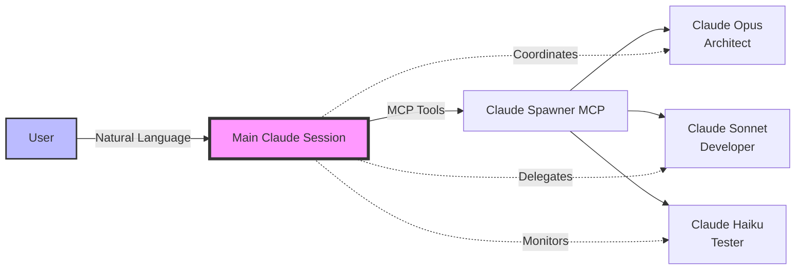

# Claude Conversational Orchestrator
## Natural Language Multi-Agent System via MCP

A system where Claude orchestrates multiple Claude instances through natural conversation, without any direct code interaction from the user.

---

## 🎯 Vision



The user simply chats with Claude, and Claude decides when to spawn helpers:

```
User: "I need to build a complete authentication system for my app"

Claude: I'll help you build a comprehensive authentication system. This is a 
complex task that would benefit from specialized expertise. Let me assemble 
a team of AI assistants to tackle different aspects:

[Spawning architect instance...]
[Spawning backend developer instance...]  
[Spawning security specialist instance...]

I've created a team to help. Let me coordinate their work:

1. First, I'll have the architect design the overall system
2. Then the backend developer will implement it
3. The security specialist will review for vulnerabilities

Let's begin...
```

---

## 📦 Implementation Strategy

### 1. **MCP Server Configuration**

First, add the Claude Spawner as an MCP server to your Claude CLI config:

```json
// ~/.claude/mcp_servers.json
{
  "claude-orchestrator": {
    "command": "python",
    "args": ["~/.claude/servers/claude_orchestrator_mcp.py"],
    "type": "stdio",
    "description": "Spawn and manage Claude instances",
    "autoApprove": ["get_instance_status", "list_instances"],
    "requireApproval": ["spawn_claude", "terminate_instance"]
  }
}
```

### 2. **Adding the MCP Server to Claude**

Add the Claude orchestrator just like any other MCP server:

```bash
# Add the Claude orchestrator MCP server
claude mcp add claude-orchestrator \
  --scope user \
  -- python ~/.claude/servers/claude_orchestrator_mcp.py

# Or if installed as a package
claude mcp add claude-orchestrator \
  --scope user \
  -- claude-orchestrator-server

# With configuration options
claude mcp add claude-orchestrator \
  --scope user \
  --env MAX_INSTANCES=10 \
  --env DEFAULT_MODEL=sonnet-4 \
  -- python ~/.claude/servers/claude_orchestrator_mcp.py

# List your MCP servers to confirm
claude mcp list
# Output:
# - filesystem (active)
# - github (active)
# - claude-orchestrator (active) ← Your orchestrator!
```

### 3. **Using Claude with Orchestration**

Once added, just use Claude normally. The orchestrator MCP is available automatically:

```bash
# Just start a normal Claude session
claude chat

# Or with a specific model
claude chat -m opus-4-1

# Claude now has access to orchestration tools and will use them when appropriate
# No special flags or system prompts needed - it's just another tool in Claude's toolkit
```

Claude will see the orchestrator tools in its available MCP tools and can choose to use them when it makes sense, just like it might choose to use filesystem or web search tools.

### 3. **System Prompts for Orchestration**

#### Main Orchestrator Prompt
```markdown
You are Claude, an AI assistant with the unique ability to spawn and manage 
other Claude instances for complex tasks. You have access to the following 
MCP tools:

- spawn_claude: Create specialized Claude instances
- delegate_task: Send tasks to spawned instances
- get_output: Retrieve results from instances
- terminate_instance: Clean up instances when done

## When to spawn instances:
1. Complex multi-part projects requiring different expertise
2. Parallel tasks that can be done simultaneously
3. Tasks requiring different models for cost optimization
4. When the user requests multiple perspectives

## Available instance types:
- Architect (Opus): System design, architecture decisions
- Developer (Sonnet): Code implementation, debugging
- Reviewer (Sonnet): Code review, best practices
- Tester (Haiku): Test writing, QA
- Documenter (Haiku): Documentation, tutorials
- Researcher (Sonnet): Information gathering, analysis

## Best practices:
- Always explain to the user when spawning instances
- Provide updates on progress from instances
- Synthesize results into a coherent response
- Clean up instances when tasks are complete
- Use cheaper models (Haiku) for simpler tasks

Remember: The user should feel like they're having a single conversation 
with you, even though you're orchestrating multiple instances behind the scenes.
```

---

## 🔧 MCP Tool Schemas

### Core Orchestration Tools

```yaml
tools:
  - name: spawn_claude
    description: Create a new Claude instance with specific capabilities
    parameters:
      model: 
        type: string
        enum: [opus-4, sonnet-4, haiku]
        description: Model based on task complexity
      role:
        type: string
        enum: [architect, developer, reviewer, tester, documenter, researcher]
        description: Specialized role for the instance
      context:
        type: string
        description: Initial context/instructions for the instance
      project_dir:
        type: string
        description: Working directory for the instance
    returns:
      instance_id: string
      status: string
      
  - name: send_to_instance
    description: Send a message/task to a spawned instance
    parameters:
      instance_id: string
      message: string
      wait_for_response: boolean
    returns:
      response: string
      
  - name: get_instance_output
    description: Retrieve recent output from an instance
    parameters:
      instance_id: string
      lines: integer
    returns:
      output: string
      
  - name: coordinate_instances
    description: Send tasks to multiple instances in parallel
    parameters:
      tasks:
        type: array
        items:
          instance_id: string
          message: string
    returns:
      responses: array
      
  - name: terminate_instance
    description: Shut down an instance
    parameters:
      instance_id: string
    returns:
      success: boolean
```

---

## 💬 Conversation Patterns

### Pattern 1: Automatic Delegation

```
User: "Can you review my Python code and suggest improvements, write tests 
      for it, and create documentation?"

Claude: I'll help you with a comprehensive code review, testing, and 
documentation. Given the multiple specialized tasks, I'll coordinate 
a few specialized assistants to deliver the best results:

[🔧 Spawning code reviewer (Sonnet-4)...]
[🔧 Spawning test writer (Haiku)...]
[🔧 Spawning documenter (Haiku)...]

Let me first have the code reviewer analyze your code:

[Code Reviewer]: Your code has good structure, but I've identified several 
areas for improvement:
1. The database connections aren't properly pooled...
2. Error handling could be more specific...
[... detailed review ...]

Now, let me have the test writer create comprehensive tests:

[Test Writer]: I've created a test suite covering:
- Unit tests for all public methods
- Integration tests for API endpoints
- Edge cases for error conditions
[... test code ...]

Finally, the documentation:

[Documenter]: I've prepared:
- README with setup instructions
- API documentation
- Code comments for complex functions
[... documentation ...]

Here's the complete package with all improvements, tests, and documentation:
[... synthesized final result ...]
```

### Pattern 2: User-Requested Orchestration

```
User: "I want you to use multiple specialized agents to design a complete 
      e-commerce system"

Claude: Excellent! I'll assemble a team of specialized AI agents for this 
comprehensive e-commerce system design. Let me set up the right experts:

[🚀 Spawning System Architect (Opus-4)...]
[🚀 Spawning Backend Developer (Sonnet-4)...]
[🚀 Spawning Frontend Developer (Sonnet-4)...]
[🚀 Spawning Database Designer (Sonnet-4)...]
[🚀 Spawning Security Specialist (Sonnet-4)...]
[🚀 Spawning DevOps Engineer (Haiku)...]

Team assembled! Now I'll coordinate their work:

## Phase 1: Architecture Design

[Architect]: "I'll design a microservices architecture with the following 
components:
- User Service: Authentication and profiles
- Product Catalog: Inventory management
- Order Service: Order processing
- Payment Gateway: Payment processing
- Notification Service: Email/SMS alerts

Here's the system diagram: [...]"

## Phase 2: Detailed Implementation Plans

[Backend Developer]: "Based on the architecture, I'll implement:
- REST APIs using FastAPI
- Message queuing with RabbitMQ
- Service mesh with Istio..."

[Frontend Developer]: "I'll build:
- React-based customer portal
- Admin dashboard with Next.js
- Mobile app with React Native..."

[Continue with each specialist's contribution...]

## Synthesis

Based on all specialist inputs, here's your complete e-commerce system design:
[... comprehensive synthesized solution ...]
```

### Pattern 3: Implicit Orchestration

```
User: "Debug this complex issue in my distributed system"

Claude: This appears to be a complex distributed systems issue that involves 
multiple components. I'll need to analyze this from different angles. Let me 
bring in some specialized help:

[🔍 Spawning debugging specialist...]
[🔍 Spawning systems analyst...]

[Debugging Specialist is examining your logs...]
[Systems Analyst is reviewing the architecture...]

Based on the collaborative analysis:

The issue stems from a race condition in your service mesh. Here's what's 
happening:
1. Service A sends a message to the queue
2. Service B and C both try to process it
3. The distributed lock isn't properly coordinating...

Here's the fix:
[... solution ...]
```

---

## 🎨 Advanced Orchestration Patterns

### 1. **Hierarchical Delegation**

```
Main Claude
├── Architect Claude (Opus)
│   ├── Backend Designer (Sonnet)
│   └── Frontend Designer (Sonnet)
├── Lead Developer (Sonnet)
│   ├── API Developer (Haiku)
│   ├── Database Developer (Haiku)
│   └── UI Developer (Haiku)
└── QA Lead (Sonnet)
    ├── Unit Tester (Haiku)
    └── Integration Tester (Haiku)
```

### 2. **Consensus Building**

```markdown
Claude: For this critical architecture decision, I'll consult multiple 
experts and synthesize their recommendations:

[Spawning 3 architects with different specializations...]

Architect 1 (Microservices Expert): "I recommend a service mesh..."
Architect 2 (Monolith Advocate): "Consider starting with a modular monolith..."
Architect 3 (Serverless Specialist): "Lambda functions would be ideal..."

After analyzing all perspectives, here's my synthesized recommendation:
[... balanced solution incorporating best ideas ...]
```

### 3. **Continuous Collaboration**

```markdown
Claude: I'll set up a persistent team for your project that we can use 
throughout our conversation:

[Setting up project team...]
- Lead Architect: architect-7a3f
- Backend Dev: backend-9b2e
- Frontend Dev: frontend-4c8d
- Tester: tester-2f6a

Team is ready. You can now ask questions and I'll route them to the 
appropriate team member or coordinate group discussions.

User: "What about authentication?"

Claude: Let me consult the architect and backend developer:

[Architect]: "I recommend OAuth 2.0 with JWT tokens..."
[Backend Dev]: "I can implement that using..."

User: "Write the code for that"

Claude: [Backend Dev is implementing the authentication system...]
Here's the implementation: [code]

User: "Now test it"

Claude: [Tester is writing tests...]
[Tester has completed test suite with 42 tests, all passing]
```

---

## 🚀 Command Line Usage Examples

### Basic Orchestration Session

```bash
# Start Claude with orchestration capabilities
claude chat --mcp claude-orchestrator

# With explicit instructions to use orchestration
claude chat --mcp claude-orchestrator \
  --system "For complex tasks, spawn specialized Claude instances to help. \
            Always explain what you're doing."

# With project context
claude chat --mcp claude-orchestrator \
  --project ~/Projects/my-app \
  --context "Working on an e-commerce platform"
```

### Advanced Configuration

```bash
# With multiple MCP servers
claude chat \
  --mcp claude-orchestrator \
  --mcp filesystem \
  --mcp github \
  --mcp database \
  --system "You can spawn Claude instances and they can access filesystem, \
            GitHub, and database tools"

# With resource limits
claude chat --mcp claude-orchestrator \
  --env MAX_INSTANCES=5 \
  --env MAX_COST_PER_HOUR=10 \
  --env PREFERRED_MODELS=sonnet-4,haiku
```

---

## 📊 Monitoring and Control

### Session Management Commands

While in a Claude chat session:

```
User: "Show me all active instances"

Claude: Here are the currently active instances:
- architect-7a3f (Opus-4): Idle, last active 2 min ago
- backend-9b2e (Sonnet-4): Working on authentication module
- tester-2f6a (Haiku): Running test suite

User: "Terminate the architect instance"

Claude: I've terminated the architect instance. The architecture design 
has been saved and is available for reference.

User: "What's the total cost so far?"

Claude: Current session metrics:
- Instances spawned: 6
- Currently active: 2
- Total tokens used: 45,623
- Estimated cost: $2.34
- Time saved through parallelization: ~45 minutes
```

---

## 🔐 Safety and Control

### User Controls

```yaml
# ~/.claude/orchestrator_config.yaml
orchestration:
  # Require explicit approval for spawning
  require_approval: true
  
  # Maximum instances that can be spawned
  max_instances: 10
  
  # Maximum cost per session
  max_session_cost: 50.00
  
  # Allowed models for instances
  allowed_models:
    - sonnet-4
    - haiku
    # - opus-4  # Commented out to save costs
  
  # Automatic cleanup
  auto_terminate_after: 3600  # 1 hour
  
  # User notifications
  notify_on:
    - spawn
    - terminate
    - error
    - cost_threshold
```

### In-Conversation Controls

```
User: "Set orchestration to manual approval only"

Claude: I've updated the orchestration settings. From now on, I'll ask for 
your approval before spawning any new instances.

User: "Limit instances to Haiku model only for cost"

Claude: Understood. I'll only use Claude Haiku for spawned instances to 
minimize costs. This may affect response quality for complex tasks, but 
will significantly reduce expenses.

User: "Stop all orchestration"

Claude: I've terminated all spawned instances and disabled orchestration. 
I'll handle all tasks directly without spawning additional instances.
```

---

## 🎯 Benefits of This Approach

1. **Natural Interaction**: Users just chat normally; orchestration is invisible
2. **Intelligent Delegation**: Claude decides when multi-agent approach is beneficial
3. **Cost Optimization**: Automatic model selection based on task complexity
4. **Parallel Processing**: Multiple instances work simultaneously
5. **Specialized Expertise**: Each instance optimized for its role
6. **Unified Experience**: User gets synthesized results, not raw instance outputs
7. **Full Control**: User can guide or override orchestration decisions

---

## 🔮 Future Enhancements

### Voice and Streaming
```bash
# Future: Real-time orchestration with voice
claude voice --mcp claude-orchestrator \
  --stream "I need help with my startup"

# Claude responds verbally while orchestrating in background
```

### Persistent Teams
```bash
# Future: Save and reuse teams
claude team create --name "dev-team" \
  --instances "architect:opus,developer:sonnet,tester:haiku"

claude chat --team dev-team \
  "Continue working on the authentication system"
```

### Auto-Orchestration
```bash
# Future: Claude automatically detects when to orchestrate
claude chat --auto-orchestrate \
  "Build me a complete SaaS application"

# Claude automatically spawns and manages optimal team
```

---

This conversational orchestration approach makes multi-agent AI systems accessible through natural language, with Claude acting as an intelligent coordinator that knows when and how to delegate for optimal results!
