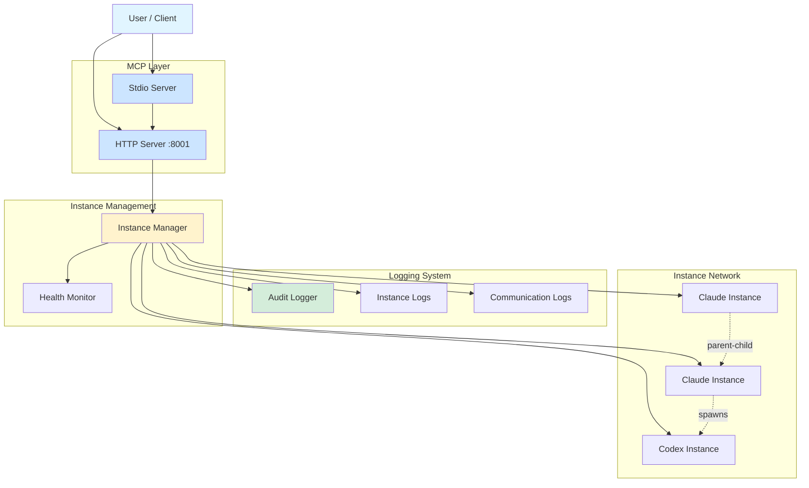

# Madrox Documentation

Comprehensive documentation for the Madrox multi-agent orchestration system.

## 📚 Documentation Index

| Document | Description | Key Topics |
|----------|-------------|------------|
| [DESIGN.md](DESIGN.md) | System architecture and design philosophy | MCP protocol, natural language orchestration, multi-instance coordination |
| [API_ENDPOINTS.md](API_ENDPOINTS.md) | HTTP REST API reference | Tool endpoints, instance management, network queries |
| [MCP_SERVER_CONFIGURATION.md](MCP_SERVER_CONFIGURATION.md) | MCP server configuration for child instances | Custom MCP servers, Playwright, browser automation, Claude vs Codex |
| [LOGGING.md](LOGGING.md) | Logging and audit system | Per-instance logs, audit trails, structured logging, log queries |
| [INTERRUPT_FEATURE.md](INTERRUPT_FEATURE.md) | Task interruption capabilities | Stop tasks without termination, context preservation, parallel interrupts |
| [STRESS_TESTING.md](STRESS_TESTING.md) | Comprehensive testing schemes | Unified visibility, cascade termination, multi-level hierarchies, concurrent operations |
| [BIDIRECTIONAL_MESSAGING_DESIGN.md](BIDIRECTIONAL_MESSAGING_DESIGN.md) | Bidirectional instance communication | Parent-child messaging, reply_to_caller, message correlation |
| [BIDIRECTIONAL_TESTING_RESULTS.md](BIDIRECTIONAL_TESTING_RESULTS.md) | Bidirectional messaging validation | Test results, communication patterns, protocol verification |

## 🚀 Quick Navigation

### Getting Started
- Installation: See [../README.md](../README.md#installation)
- Quick Start: See [../README.md](../README.md#quick-start)
- MCP Integration: See [../README.md](../README.md#mcp-protocol-integration)

### Core Concepts
- **Hierarchical Orchestration**: [DESIGN.md](DESIGN.md) - Parent-child instance relationships
- **Multi-Model Support**: [../README.md](../README.md#features) - Claude + Codex + future models
- **Role-Based Specialization**: [../README.md](../README.md#instance-roles--customization) - 10 predefined expert roles
- **MCP Server Configuration**: [MCP_SERVER_CONFIGURATION.md](MCP_SERVER_CONFIGURATION.md) - Dynamic tool loading for child instances

### Operations
- **Instance Management**: [API_ENDPOINTS.md](API_ENDPOINTS.md#instance-management-endpoints)
- **Network Queries**: [API_ENDPOINTS.md](API_ENDPOINTS.md#network-hierarchy-endpoint)
- **Logging & Auditing**: [LOGGING.md](LOGGING.md)
- **Task Interruption**: [INTERRUPT_FEATURE.md](INTERRUPT_FEATURE.md)

### Testing & Validation
- **Unit Tests**: [../README.md](../README.md#testing) - 26 tests, 86% coverage
- **Integration Tests**: [../tests/integration_demo.py](../tests/integration_demo.py)
- **Stress Tests**: [STRESS_TESTING.md](STRESS_TESTING.md) - Production validation scenarios

## 🔍 Key Features by Document

### DESIGN.md
- Natural language multi-agent orchestration
- MCP protocol implementation details
- Instance spawning architecture
- Communication patterns (parent ↔ child, broadcast, coordination)

### API_ENDPOINTS.md
- HTTP REST API for direct integration
- Tool execution endpoints
- Instance status queries
- Network hierarchy visualization

### MCP_SERVER_CONFIGURATION.md
- **Claude instances**: JSON config files, stdio & HTTP transports
- **Codex instances**: `codex mcp add` commands, stdio only
- **Prebuilt configs**: 10+ MCP servers (Playwright, GitHub, databases)
- **MCP loader utility**: Easy config loading and customization
- **Browser automation**: Playwright for web scraping and testing

### LOGGING.md
- Per-instance isolated logs (instance.log, communication.jsonl, tmux_output.log)
- System-wide audit trail (JSONL format, daily rotation)
- Structured queries for debugging and analysis
- Token usage and cost tracking

### INTERRUPT_FEATURE.md
- Non-destructive task interruption
- Context preservation during interrupts
- Parallel interrupt operations
- Recovery and redirection workflows

### STRESS_TESTING.md
- **Test 1**: Unified visibility (stdio→HTTP proxy validation)
- **Test 2**: Cascade termination (2-level hierarchies)
- **Test 3**: Hierarchy filtering (terminated instance exclusion)
- **Test 4**: Multi-level cascade (3-level grandparent→parent→child)
- **Test 5**: Concurrent operations (parallel spawning, messaging)

### BIDIRECTIONAL_MESSAGING_DESIGN.md
- Parent-child bidirectional communication
- `reply_to_caller` tool for instant responses
- Message correlation and tracking
- Hierarchical message passing patterns

## 🛠️ Common Workflows

### Spawning Instances with Custom MCP Servers
1. Choose MCP servers: [MCP_SERVER_CONFIGURATION.md#quick-start](MCP_SERVER_CONFIGURATION.md#quick-start-using-prebuilt-configs)
2. Load configs: Use `get_mcp_servers("playwright", "github")`
3. Spawn instance: Pass `mcp_servers` parameter
4. Verify tools: Check instance has access to MCP tools

### Debugging Stuck Instances
1. Check instance logs: [LOGGING.md#per-instance-logs](LOGGING.md#per-instance-logs)
2. Review tmux output: [LOGGING.md#tmux-output-logs](LOGGING.md#tmux-output-logs)
3. Query instance status: [API_ENDPOINTS.md#instance-status](API_ENDPOINTS.md#instance-status-endpoint)
4. Interrupt if needed: [INTERRUPT_FEATURE.md#basic-usage](INTERRUPT_FEATURE.md#basic-usage)

### Validating New Features
1. Run unit tests: `uv run pytest tests/test_orchestrator.py -v`
2. Run integration demo: `uv run python tests/integration_demo.py`
3. Run stress tests: [STRESS_TESTING.md#comprehensive-stress-test-script](STRESS_TESTING.md#comprehensive-stress-test-script)
4. Check audit logs: [LOGGING.md#audit-log-analysis](LOGGING.md#audit-log-analysis)

### Tracking Costs & Performance
1. Query audit trail: [LOGGING.md#audit-trail-queries](LOGGING.md#audit-trail-queries)
2. Analyze token usage: [LOGGING.md#cost-tracking](LOGGING.md#cost-tracking)
3. Review response times: [LOGGING.md#performance-metrics](LOGGING.md#performance-metrics)

## 📊 Architecture Overview

## 🔗 External Resources

- [Anthropic MCP Specification](https://modelcontextprotocol.io/)
- [Claude API Documentation](https://docs.anthropic.com/)
- [OpenAI Codex Documentation](https://platform.openai.com/docs/models/codex)

## 🤝 Contributing

When adding new features:
1. Update relevant documentation in `docs/`
2. Add tests to `tests/test_orchestrator.py`
3. Update `README.md` with user-facing changes
4. Add stress test scenarios if applicable ([STRESS_TESTING.md](STRESS_TESTING.md))
5. Document API changes in [API_ENDPOINTS.md](API_ENDPOINTS.md)

---

**For the main project README**: [../README.md](../README.md)
