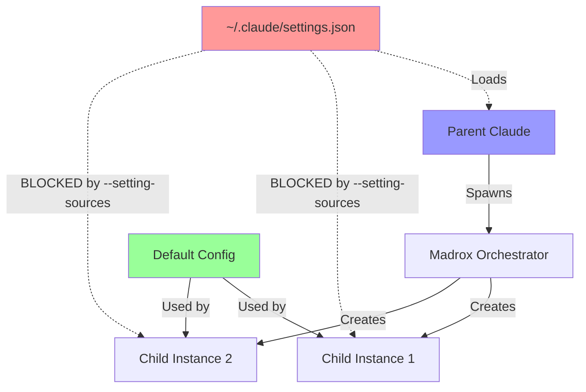
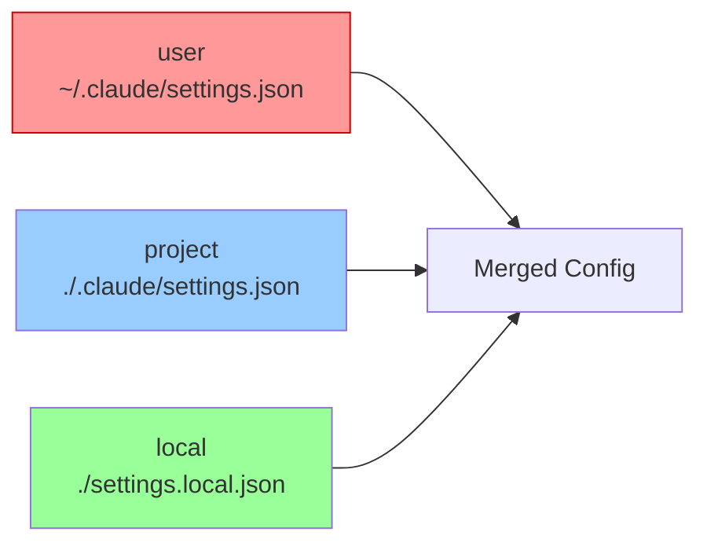
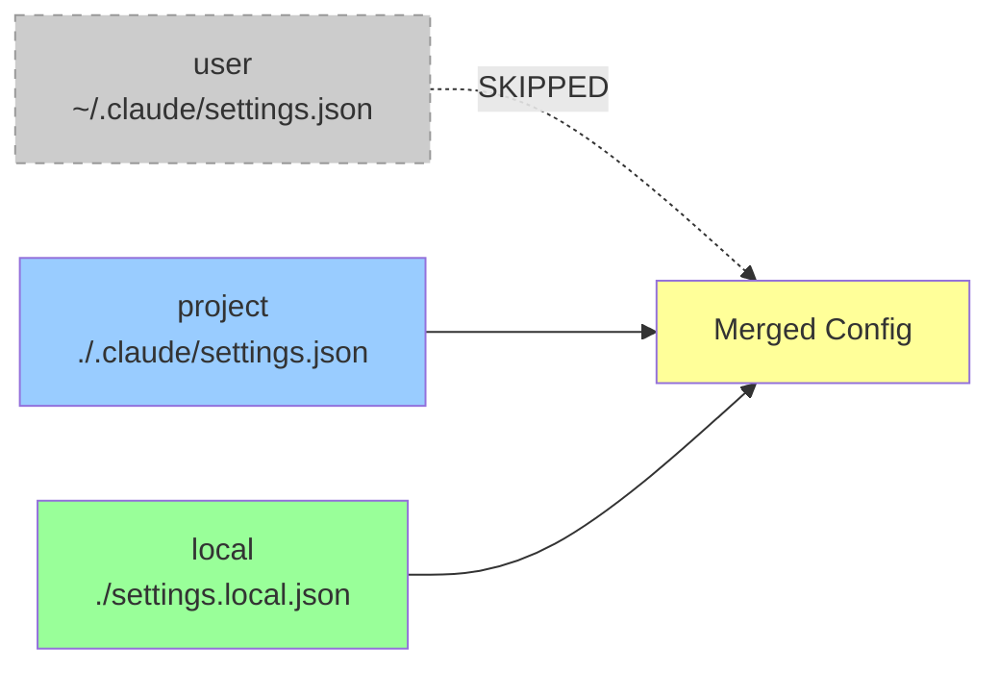
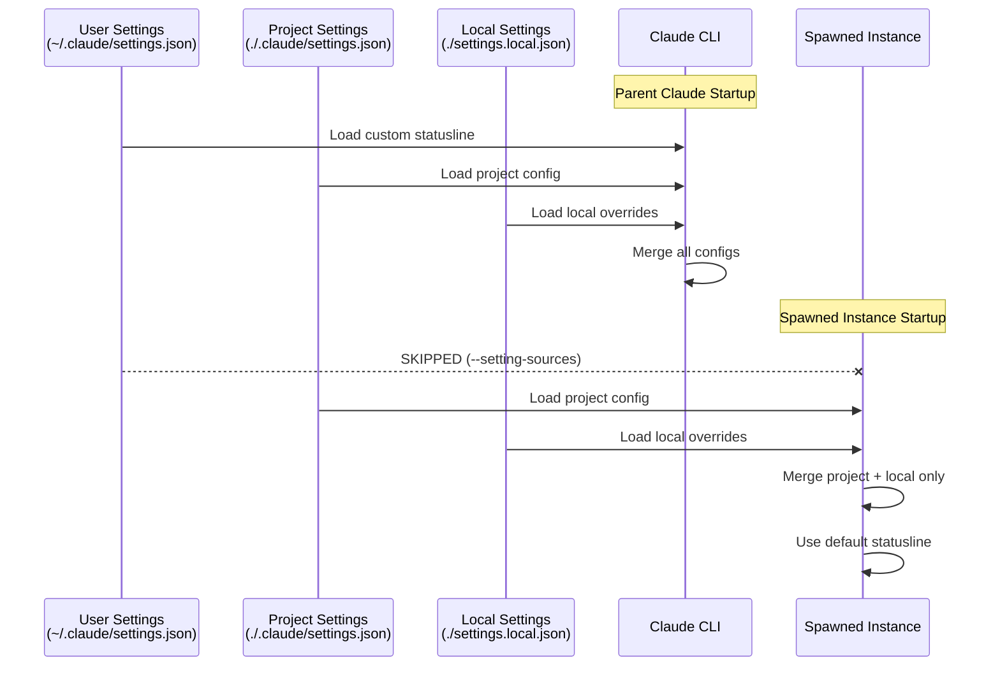

# Statusline Isolation in Spawned Instances

## Overview

Madrox now prevents spawned Claude instances from inheriting the parent's custom statusline configuration. This ensures clean, default statuslines in spawned instances while preserving the parent's custom configuration.

## Problem Statement

When madrox spawned new Claude CLI instances, they inherited the parent's `~/.claude/settings.json` configuration, including custom statusline scripts. This caused:

- Spawned instances showing complex multi-line statuslines
- Inconsistent UI between parent and child instances
- Potential conflicts with workspace isolation

## Solution

**Implementation:** `src/orchestrator/tmux_instance_manager.py:1048-1052`

```python
# Override statusline configuration to prevent inheritance from parent
# SOLUTION: Use --setting-sources to prevent loading user settings entirely
# This prevents ~/.claude/settings.json from being loaded, which contains the statusline config
# Only load 'local' and 'project' settings, skip 'user' settings
cmd_parts.extend(["--setting-sources", "local,project"])
```

## Architecture



## Configuration Sources

Claude CLI loads settings from three sources with hierarchical priority:



**With `--setting-sources local,project`:**



## How It Works

### Default Behavior (Parent Claude)

```bash
claude
# Loads: user + project + local settings
# Result: Custom statusline from ~/.claude/settings.json
```

### Spawned Instance Behavior

```bash
claude --setting-sources local,project
# Loads: project + local settings only
# Result: Default statusline (no custom script)
```

### Settings Loading Flow



## Command Comparison

### Parent Claude Command

```bash
claude --permission-mode bypassPermissions
```

**Settings Loaded:**
- ✅ `~/.claude/settings.json` (custom statusline)
- ✅ `./.claude/settings.json` (project settings)
- ✅ `./settings.local.json` (local overrides)

**Result:** Multi-line custom statusline with progress bars, git branch, recent prompts

---

### Spawned Instance Command

```bash
claude --permission-mode bypassPermissions \
       --dangerously-skip-permissions \
       --mcp-config /tmp/claude_orchestrator/{id}/.claude_mcp_config.json \
       --setting-sources local,project
```

**Settings Loaded:**
- ❌ `~/.claude/settings.json` (**SKIPPED**)
- ✅ `./.claude/settings.json` (project settings)
- ✅ `./settings.local.json` (local overrides)

**Result:** Default single-line statusline

## Testing

### Verification Steps

1. **Check Parent Statusline:**
   ```bash
   # Should show multi-line custom statusline
   tmux attach -t <parent-session>
   ```

2. **Spawn Test Instance:**
   ```python
   spawn_claude(name="test", role="general")
   ```

3. **Verify Child Statusline:**
   ```bash
   # Should show default statusline only
   tmux attach -t madrox-<instance-id>
   ```

4. **Check Command:**
   ```bash
   tmux capture-pane -p -t madrox-<instance-id> | grep "claude --"
   # Should contain: --setting-sources local,project
   ```

### Test Results

| Instance ID | Flag Used | Statusline Result | Status |
|-------------|-----------|-------------------|--------|
| d401bd99... | `--setting-sources local,project` | Default (no custom) | ✅ PASS |
| Parent | (none) | Custom multi-line | ✅ PASS |

## Alternative Approaches (Failed)

### Approach 1: `--settings` with null

```python
cmd_parts.extend(["--settings", '\'{"statusLine":null}\''])
```

**Why it failed:** Claude CLI **merges** `--settings` with user config instead of replacing it. The custom statusline from `~/.claude/settings.json` still loads.

---

### Approach 2: `--settings` with empty object

```python
cmd_parts.extend(["--settings", '\'{"statusLine":{}}\''])
```

**Why it failed:** Empty object doesn't override existing statusline configuration. Settings are merged, not replaced.

---

### Approach 3: Environment variables

**Attempted:** Look for `CLAUDE_CONFIG_PATH` or similar

**Why it failed:** No such environment variable exists in Claude CLI

## Implementation Details

### File Location

```
src/orchestrator/tmux_instance_manager.py
└── _initialize_tmux_session()
    └── Lines 1048-1052
```

### Code Context

```python
def _initialize_tmux_session(self, instance_id: str):
    # ... earlier setup ...

    if instance_type == "codex":
        # Codex CLI command
        cmd_parts = ["codex", ...]
    else:
        # Claude CLI command (interactive mode)
        cmd_parts = [
            "claude",
            "--permission-mode",
            "bypassPermissions",
            "--dangerously-skip-permissions",
        ]

        if mcp_config_path := instance.get("_mcp_config_path"):
            cmd_parts.extend(["--mcp-config", mcp_config_path])

        # ⭐ STATUSLINE ISOLATION FIX ⭐
        cmd_parts.extend(["--setting-sources", "local,project"])

        if model := instance.get("model"):
            cmd_parts.extend(["--model", model])
```

## Side Effects

### What Changes

- ✅ Spawned instances skip `~/.claude/settings.json`
- ✅ Custom statusline no longer inherited
- ✅ Default Claude statusline used instead

### What Doesn't Change

- ✅ Parent Claude keeps custom statusline
- ✅ Project-specific settings still load (`./.claude/settings.json`)
- ✅ Local overrides still work (`./settings.local.json`)
- ✅ All other Claude CLI functionality unchanged
- ✅ MCP servers, permissions, model settings unaffected

## Backwards Compatibility

**Full backwards compatibility:** ✅

- Existing spawned instances unaffected until orchestrator restart
- Parent Claude functionality unchanged
- Only affects newly spawned instances after code update
- No configuration migration required
- No breaking changes to API or behavior

## Future Considerations

### Customizing Spawned Instance Settings

If you need custom settings for spawned instances:

1. **Option 1:** Add `.claude/settings.json` to workspace directory
   ```json
   {
     "statusLine": {
       "type": "command",
       "command": "/path/to/custom/script.sh"
     }
   }
   ```

2. **Option 2:** Use `settings.local.json` in workspace
   ```json
   {
     "statusLine": null
   }
   ```

3. **Option 3:** Modify spawn command in code to add `--settings` flag

### Making Statusline Configurable

To make statusline behavior configurable per instance:

```python
# Add parameter to spawn_instance
async def spawn_instance(
    self,
    name: str | None = None,
    inherit_user_settings: bool = False,  # New parameter
    # ... other params ...
):
    # ...

    if not inherit_user_settings:
        cmd_parts.extend(["--setting-sources", "local,project"])
    # else: load all settings including user
```

## Related Documentation

- [Claude CLI Documentation](https://docs.claude.com)
- [Madrox Architecture](./ARCHITECTURE.md)
- [MCP Configuration](./MCP_SETUP.md)

## Changelog

**2025-10-08:** Initial implementation of statusline isolation using `--setting-sources` flag
