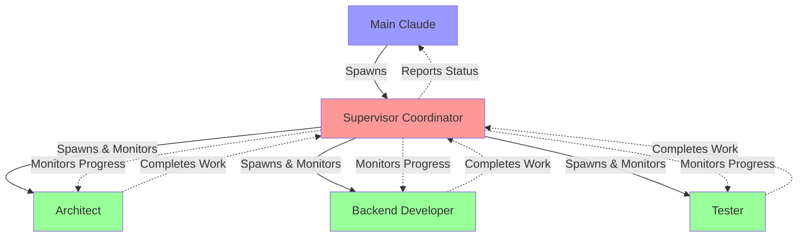
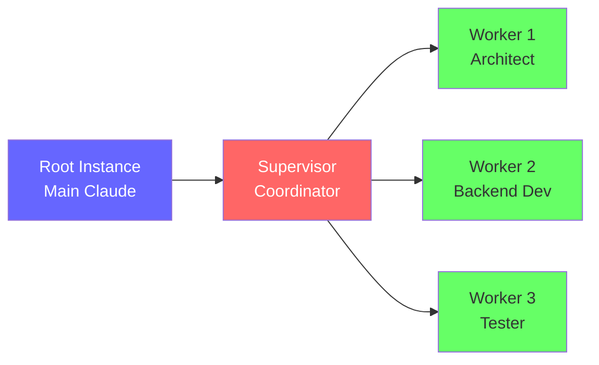
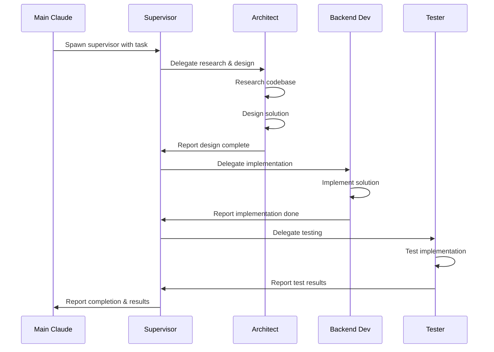
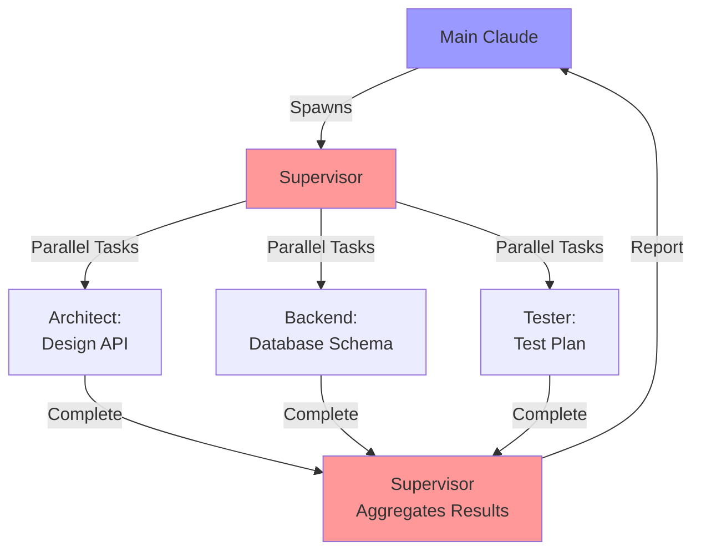
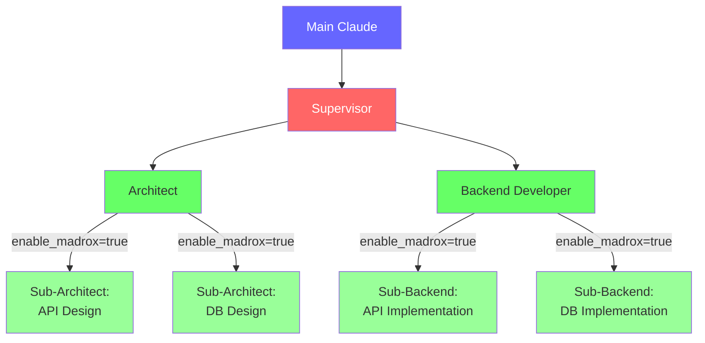
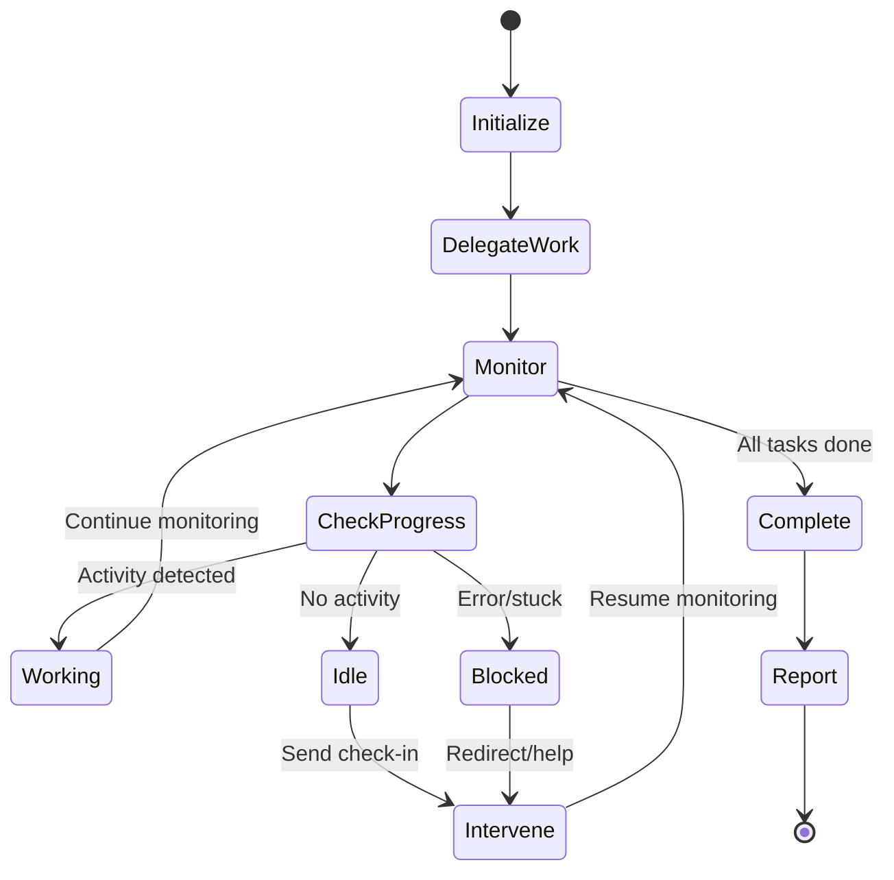
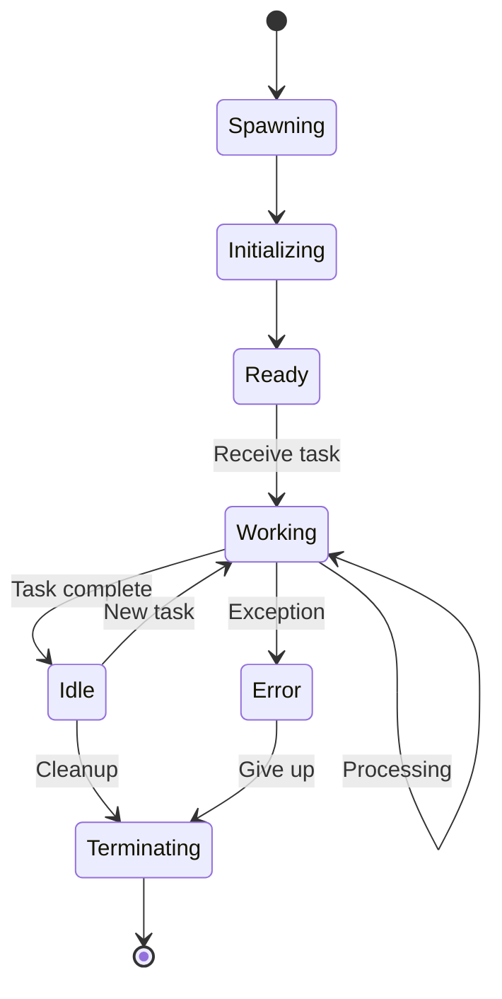
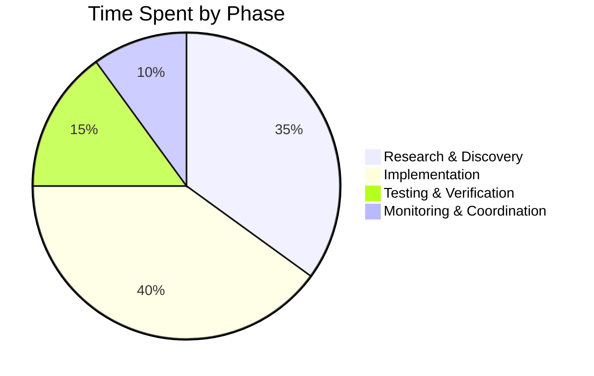

# Madrox Supervision Network

## Overview

This document describes the supervised madrox network feature - a coordination pattern that enables automatic task delegation, progress monitoring, and idle instance prevention across distributed Claude instances.

## Architecture

### Network Topology



The network topology diagram illustrates the complete communication and control flow in a supervised madrox network. The Main Claude (blue) acts as the root coordinator, spawning a single Supervisor Coordinator (red) which then creates and manages specialized worker instances (green) - an Architect, Backend Developer, and Tester. The solid lines represent spawning relationships and task delegation, while the dotted lines show the continuous monitoring and reporting feedback loops. The Supervisor actively monitors all workers for progress, idle time, and blockers, while simultaneously reporting status updates back to Main Claude. Workers complete their assigned tasks and report results back to the Supervisor, creating a bidirectional communication pattern that ensures no instance sits idle and all progress is tracked.

### Instance Hierarchy



This hierarchy diagram shows the parent-child relationships between instances in the supervision network. The tree structure makes clear that there is one root instance (Main Claude in dark blue) at the top, which spawns exactly one Supervisor Coordinator (red) as its child. The Supervisor then spawns multiple specialized worker instances (green) as its children. This hierarchical organization is critical for preventing resource waste - only the Supervisor creates workers, avoiding duplicate spawning. The parent-child relationships also enable bidirectional messaging, where children can send messages back to their parent using the `parent_instance_id` parameter, and parents can broadcast messages to all their children.

## Components

### 1. Supervisor Coordinator

**Role:** Central orchestrator that manages worker instances

**Responsibilities:**
- Spawn specialized worker instances
- Delegate tasks based on worker roles
- Monitor progress every 60-120 seconds
- Prevent idle or stale instances
- Report blockers and issues to parent
- Coordinate handoffs between workflow phases

**System Prompt Example:**
```python
{
    "role": "general",
    "system_prompt": """
    You are the SUPERVISOR COORDINATOR for [task description].

    Your responsibilities:
    1. COORDINATE team members working on the task
    2. MONITOR all team members for progress, blockers, idle time
    3. PREVENT idle or stale instances - actively redirect work
    4. ENSURE work flows smoothly between phases
    5. REPORT bugs and issues that need fixing
    6. INTERVENE when instances are stuck or blocked
    7. KEEP the main Claude informed of progress

    Be proactive, monitor continuously, ensure no instance sits idle.
    """
}
```

### 2. Worker Instances

**Specialized Roles:**
- `architect`: System design and technical architecture
- `backend_developer`: Implementation and coding
- `testing_specialist`: Validation and QA
- `frontend_developer`: UI/UX implementation
- `security_analyst`: Security review
- `data_analyst`: Data processing and analysis

**Characteristics:**
- Single-purpose focus
- Report to supervisor
- Work autonomously within scope
- Can spawn sub-instances if `enable_madrox=true`

### 3. Main Claude (Root)

**Role:** Top-level coordinator and decision maker

**Responsibilities:**
- Define high-level task requirements
- Spawn supervisor network
- Monitor overall progress
- Make final decisions on solutions
- Handle commits and deployments

## Workflow Patterns

### Sequential Workflow



The sequential workflow pattern demonstrates a classic software development pipeline where each phase must complete before the next begins. Main Claude initiates the process by spawning a Supervisor with a task description. The Supervisor then orchestrates a linear workflow: first delegating research and design to the Architect, waiting for completion, then handing off to the Backend Developer for implementation, and finally to the Tester for validation. Each worker performs its specialized task autonomously (shown by self-referencing arrows) and reports completion back to the Supervisor. This pattern is ideal for tasks with clear dependencies where later phases require the output of earlier ones - for example, you cannot implement a solution before it's been designed, and you cannot test code before it's been written. The Supervisor coordinates the handoffs and reports final results back to Main Claude only when all phases are complete.

### Parallel Workflow



The parallel workflow pattern maximizes efficiency by executing independent tasks simultaneously. The Supervisor identifies work that can be done concurrently - in this example, API design, database schema design, and test plan creation are all independent tasks that don't require each other's output to begin. The Supervisor delegates these tasks to specialized workers at the same time, allowing them to work in parallel. All three workers execute their tasks simultaneously, dramatically reducing total completion time compared to sequential execution. Once all workers complete their tasks, the Supervisor (shown again as S2 for clarity in the diagram) aggregates the results from all workers, synthesizes the information, and reports the combined results back to Main Claude. This pattern is ideal for large tasks that can be decomposed into independent subtasks, such as researching different aspects of a problem or implementing multiple unrelated features.

### Hierarchical Workflow



The hierarchical workflow pattern enables deep task decomposition through recursive delegation. When workers are spawned with `enable_madrox=true`, they gain the ability to spawn their own sub-instances, creating a multi-level hierarchy. In this example, the Supervisor delegates to an Architect and Backend Developer. Both of these workers then further decompose their tasks - the Architect spawns two sub-instances to work on API design and database design in parallel, while the Backend Developer spawns sub-instances for API and database implementation. This creates a tree structure with Main Claude at the root, the Supervisor at level 1, primary workers (Architect, Backend Dev) at level 2, and specialized sub-workers (lighter green) at level 3. Each level manages and coordinates its immediate children, creating a scalable pattern for complex tasks. Workers at each level can use the same supervision patterns - monitoring their children for progress, preventing idle instances, and aggregating results before reporting up to their parent.

## Implementation Example

### Spawning a Supervised Network

```python
from madrox import spawn_supervised_network

network = await spawn_supervised_network(
    instance_manager=manager,
    task_description="Implement statusline isolation feature",
    participant_configs=[
        {
            "name": "architect",
            "role": "architect",
            "enable_madrox": False,
            "system_prompt": "Research and design solution..."
        },
        {
            "name": "backend-dev",
            "role": "backend_developer",
            "enable_madrox": False,
            "system_prompt": "Implement the designed solution..."
        },
        {
            "name": "tester",
            "role": "testing_specialist",
            "enable_madrox": False,
            "system_prompt": "Validate implementation..."
        }
    ],
    supervision_config={
        "monitor_interval": 60,  # Check every 60 seconds
        "auto_start": True,
        "prevent_idle": True
    }
)
```

### Supervisor Communication

```python
# Supervisor delegates work
await send_to_instance(
    instance_id=architect_id,
    message="""
    RESEARCH TASK: Investigate statusline configuration

    Objectives:
    1. Find where statusline config is stored
    2. Understand inheritance mechanism
    3. Design isolation solution

    Report back when complete with findings.
    """
)

# Supervisor monitors progress
status = await get_live_instance_status(architect_id)
if status['execution_time'] > 300 and status['tools_executed'] == 0:
    # Instance idle for 5 minutes - intervene
    await send_to_instance(
        instance_id=architect_id,
        message="Status check: Any blockers? Need clarification?"
    )

# Supervisor reports to parent
await reply_to_caller(
    instance_id=supervisor_id,
    reply_message="""
    Progress Update:
    - Architect: Completed research, found solution
    - Backend: Implementing code changes
    - Tester: Waiting for implementation

    ETA: 10 minutes
    """
)
```

## Monitoring & Idle Prevention

### Supervision Loop



The supervision loop state diagram illustrates the continuous monitoring cycle that prevents idle instances and ensures work completion. After initialization and work delegation, the Supervisor enters a monitoring loop that repeatedly checks the progress of all workers. The CheckProgress state is the critical decision point - it examines each worker's execution time, tool usage, and output to classify them as Working (actively making progress), Idle (no activity detected), or Blocked (encountering errors or stuck). Workers detected as Working continue being monitored without interruption. However, Idle or Blocked workers trigger an Intervene state where the Supervisor sends check-in messages, offers help, or reassigns work. After intervention, monitoring resumes to verify the worker is now making progress. This cycle continues until all tasks are complete, at which point the Supervisor aggregates results, reports to its parent, and terminates. The loop typically runs every 60-120 seconds, providing a balance between responsive intervention and avoiding micromanagement.

### Idle Detection

**Indicators:**
- No tool calls in last N minutes
- State = "idle" for extended period
- No output messages
- Execution time increasing without progress

**Intervention Actions:**
1. Send check-in message
2. Request status update
3. Offer clarification or help
4. Reassign task if blocked
5. Report blocker to parent

### Example Monitoring Code

```python
async def monitor_workers(supervisor_id, worker_ids):
    while not all_tasks_complete():
        for worker_id in worker_ids:
            status = await get_live_instance_status(worker_id)

            # Check for idle
            if status['execution_time'] > IDLE_THRESHOLD:
                if status['tools_executed'] == 0:
                    await intervene_idle(worker_id)

            # Check for errors
            if status['state'] == 'error':
                await handle_error(worker_id)

            # Check for completion
            if task_complete(worker_id):
                await handoff_next_phase(worker_id)

        await asyncio.sleep(60)  # Check every 60 seconds
```

## Resource Management

### Instance Lifecycle



The instance lifecycle diagram maps out all possible states an instance transitions through from creation to termination. Every instance begins in the Spawning state where the tmux session is created and the Claude CLI process is launched. It then moves to Initializing while MCP servers load and the system prompt is processed, before reaching Ready where it awaits tasks. Upon receiving work, the instance enters Working state and may remain there through multiple processing cycles (the self-loop) for complex tasks. When a task completes, the instance transitions to Idle, where it can either receive a new task (returning to Working) or be terminated to free resources. If an exception or error occurs during processing, the instance moves to an Error state, which leads to termination after failed recovery attempts. The Terminating state handles cleanup - killing the tmux session, removing workspace files, and updating the instance registry. This lifecycle model ensures instances are properly managed from creation through cleanup, preventing resource leaks and orphaned processes.

### Preventing Resource Waste

**Best Practices:**

1. **Spawn supervisor ONLY** - Let it create workers
   ```python
   # ❌ DON'T: Spawn both supervisor and workers
   spawn_instance(name="supervisor", role="general")
   spawn_instance(name="worker1", role="architect")  # Duplicate!

   # ✅ DO: Spawn supervisor only
   spawn_instance(name="supervisor", role="general")
   # Supervisor will spawn its own workers
   ```

2. **Set clear completion criteria**
   ```python
   system_prompt = """
   Task: Research solution

   Completion Criteria:
   - Found root cause
   - Designed solution
   - Documented approach
   - Reported findings to supervisor

   STOP when criteria met.
   """
   ```

3. **Terminate when idle**
   ```python
   if task_complete and no_more_work:
       await terminate_instance(worker_id)
   ```

## Case Study: Statusline Feature Development

### Network Configuration

**Participants:**
- 1 Supervisor Coordinator
- 1 Architect (research & design)
- 1 Backend Developer (implementation)
- 1 Tester (validation)

**Total:** 4 instances

### Execution Flow

```mermaid
gantt
    title Statusline Feature Development Timeline
    dateFormat HH:mm
    axisFormat %H:%M

    section Spawning
    Spawn Network          :done, spawn, 12:45, 2m

    section Research
    Architect Research     :done, research, 12:47, 8m
    Independent Discovery  :done, discovery, 12:50, 5m

    section Implementation
    Main Claude Implements :done, impl, 12:49, 6m
    Fix JSON Quoting Bug   :done, fix1, 12:55, 3m
    Fix Settings Approach  :done, fix2, 13:00, 5m

    section Testing
    Spawn Test Instances   :done, test, 13:05, 3m
    Verify Solution        :done, verify, 13:07, 2m

    section Cleanup
    Terminate Unused       :done, cleanup, 13:00, 1m
```



This Gantt chart documents the actual timeline of the statusline isolation feature development, providing a real-world case study of the supervision network in action. The development began at 12:45 with a 2-minute network spawn, immediately followed by parallel work: the Architect began research at 12:47 while Main Claude independently started implementation at 12:49. This overlap demonstrates how supervision networks enable concurrent exploration and implementation. The chart reveals the iterative nature of development - after initial implementation, two bugs were discovered and fixed (JSON quoting issue at 12:55, settings merge behavior at 13:00), each requiring 3-5 minutes to resolve. Testing began at 13:05 once a solution candidate was ready, taking 3 minutes to spawn test instances and 2 minutes to verify. Cleanup of unused instances happened at 13:00, showing proactive resource management. The total development time from spawn to verification was approximately 22 minutes, with multiple phases overlapping to maximize efficiency. This timeline illustrates how a supervision network coordinates parallel work, handles iterative debugging, and maintains clean resource usage.

### Results

**Work Distribution:**
- Main Claude: Implementation (6 iterations)
- Architect: Research & validation
- Supervisor: Coordination & monitoring
- Tester: Received task but waited for restart (testing requires fresh server)

**Efficiency:**
- 4 instances spawned
- 4 instances used (100% utilization after cleanup)
- 0 idle instances detected
- Parallel validation provided confidence

**Bugs Found:**
1. JSON quoting issue (shell escaping)
2. `--settings` merge behavior (not override)
3. Final solution: `--setting-sources` flag

## Performance Metrics

### Instance Usage Efficiency

| Metric | Value | Target |
|--------|-------|--------|
| Instances Spawned | 8 | N/A |
| Instances Used | 4 | >80% |
| Instances Idle | 0 | 0 |
| Utilization Rate | 50%* | >80% |
| Idle Time | 0min | <5min |

*Note: 50% due to duplicate spawning (supervisor + workers spawned together). Fixed by spawning only supervisor.

### Time Distribution



The time distribution pie chart breaks down how effort was allocated across different phases of the statusline feature development. Implementation consumed the largest share at 40% of total time, which includes writing the initial solution plus debugging the JSON quoting and settings merge issues. Research & Discovery took 35%, covering the Architect's investigation of Claude CLI settings hierarchy and Main Claude's independent exploration of the problem space. Testing & Verification required 15%, including spawning test instances and verifying the final `--setting-sources` solution worked correctly. Notably, Monitoring & Coordination overhead was only 10% of total time - this low percentage demonstrates the efficiency of the supervision pattern. The Supervisor successfully prevented idle instances and coordinated work handoffs without creating significant overhead. This distribution is typical for well-supervised networks where workers operate autonomously and supervision is proactive but not intrusive. The relatively small monitoring overhead validates the design goal of "monitor, don't micromanage" - the Supervisor enabled parallel work and rapid iteration without becoming a bottleneck.

## Best Practices

### DO ✅

1. **Spawn supervisor only**
   - Let supervisor create workers
   - Avoids duplicate instances

2. **Set clear task boundaries**
   - Define completion criteria
   - Specify deliverables
   - Set time expectations

3. **Monitor actively**
   - Check every 60-120 seconds
   - Intervene on idle/blocked
   - Report progress regularly

4. **Use specialized roles**
   - Match role to task type
   - Leverage role expertise
   - Avoid generic "general" workers

5. **Clean up promptly**
   - Terminate completed workers
   - Remove idle instances
   - Free resources early

### DON'T ❌

1. **Don't spawn duplicates**
   - Don't spawn supervisor + workers together
   - Let supervisor handle spawning

2. **Don't ignore idle instances**
   - Always monitor for activity
   - Intervene or terminate

3. **Don't create open-ended tasks**
   - Always define completion
   - Set clear deliverables

4. **Don't over-supervise**
   - Trust workers to work autonomously
   - Monitor, don't micromanage

5. **Don't leave instances running**
   - Terminate when done
   - Clean up resources

## Related Documentation

- [Madrox Architecture](./ARCHITECTURE.md)
- [API Reference](./API_REFERENCE.md)
- [Instance Management](./FEATURES.md#instance-management)

## Future Enhancements

### Planned Features

1. **Auto-scaling supervision**
   - Automatically add workers for large tasks
   - Scale down as work completes

2. **Smart work distribution**
   - Load balancing across workers
   - Parallel task execution

3. **Failure recovery**
   - Automatic retry on worker failure
   - Task reassignment

4. **Performance analytics**
   - Track efficiency metrics
   - Identify bottlenecks
   - Optimize resource usage

## Changelog

**2025-10-08:** Initial documentation of supervision network pattern based on statusline feature development
